# GrowwPulse — System Architecture Document

> **Version:** 1.0  
> **Last Updated:** 2026-05-21  
> **Status:** Living Document  
> **Audience:** Engineering, Product, Leadership

---

## Table of Contents

1. [System Overview](#1-system-overview)
2. [Component Architecture](#2-component-architecture)
3. [Data Flow Diagram](#3-data-flow-diagram)
4. [MCP Architecture Deep Dive](#4-mcp-architecture-deep-dive)
5. [Directory Structure](#5-directory-structure)
6. [Technology Stack](#6-technology-stack)
7. [Security & Privacy Architecture](#7-security--privacy-architecture)
8. [Scalability & Future Considerations](#8-scalability--future-considerations)

---

## 1. System Overview

### 1.1 What is GrowwPulse?

**GrowwPulse** is an AI-agent-driven pipeline that automatically ingests public App Store and Play Store reviews for the [Groww](https://groww.in) investment app, classifies them into actionable themes, and produces a concise **≤250-word weekly pulse note** — delivered as a styled Gmail draft or email via **MCP (Model Context Protocol)** servers.

The system targets the recurring pain of product, support, and leadership teams who need a fast, structured weekly view of user sentiment without manually trawling hundreds of reviews.

### 1.2 End-to-End System Architecture

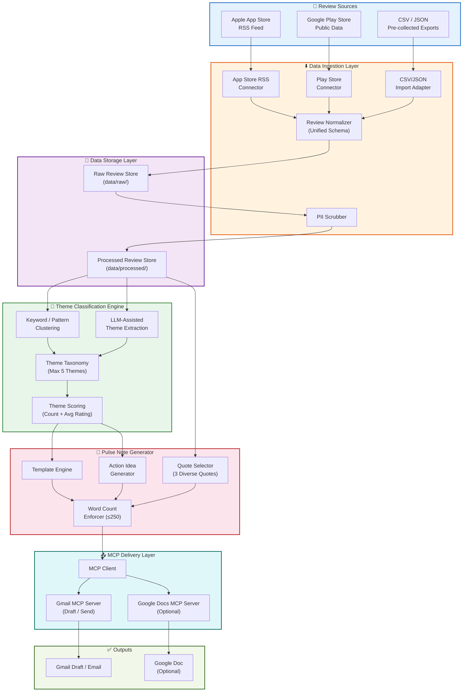

### 1.3 Key Design Principles

| Principle | Description |
|:---|:---|
| **MCP-First Integration** | All external service interactions (Gmail, Google Docs) are routed through MCP servers — no direct Google API client code |
| **No PII Storage** | Personally identifiable information is stripped at ingestion; no raw PII persists in any artifact |
| **Public Data Only** | All review data comes from publicly accessible feeds and exports; no scraping behind authentication |
| **Modular Pipeline** | Each layer (ingestion, classification, generation, delivery) is independently testable and replaceable |
| **File-Based Storage** | JSON/CSV flat files — no external database required, simplifying deployment and portability |
| **Deterministic Output** | The pulse note follows a strict template with enforced word limits for consistency across runs |
| **Credential Isolation** | OAuth tokens and API secrets live exclusively in MCP server configuration, never in application code |
| **Idempotent Execution** | Re-running the pipeline for the same week produces the same output; safe to retry on failure |

---

## 2. Component Architecture

### 2.1 Data Ingestion Layer

The ingestion layer is responsible for pulling reviews from multiple sources, normalizing them into a unified schema, and scrubbing PII before storage.

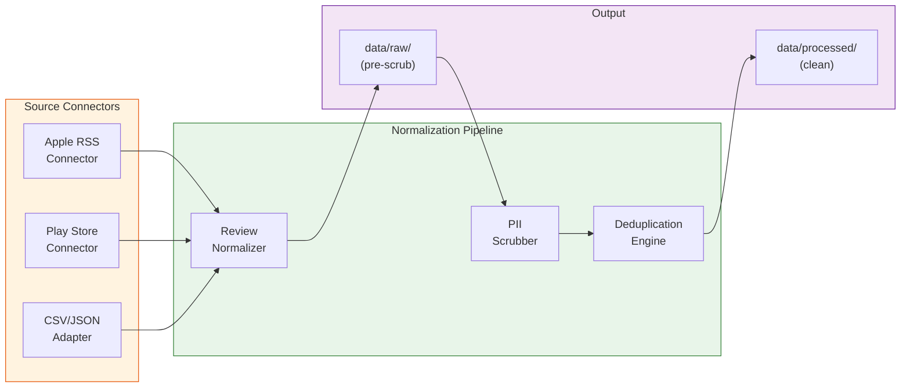

#### 2.1.1 Apple App Store RSS Feed Connector

| Attribute | Detail |
|:---|:---|
| **Source URL** | `https://itunes.apple.com/rss/customerreviews/page={1-10}/id=1404871703/sortby=mostrecent/json` |
| **Format** | JSON (RSS-like structure) |
| **Pagination** | Pages 1–10 (≈500 reviews max) |
| **Rate Limiting** | Polite 1-second delay between page fetches |
| **Fields Extracted** | `im:rating`, `title.label`, `content.label`, `updated.label`, `author.name.label` |
| **Error Handling** | Retry up to 3 times with exponential backoff on HTTP errors |

**Request Flow:**
```
GET https://itunes.apple.com/rss/customerreviews/page=1/id=1404871703/sortby=mostrecent/json
→ Parse JSON response
→ Extract entries from feed.entry[]
→ Map fields to unified schema
→ Paginate through pages 1–10
```

#### 2.1.2 Google Play Store Public Data Connector

| Attribute | Detail |
|:---|:---|
| **Package ID** | `com.nextbillion.groww` |
| **Method** | Open-source libraries (`google-play-scraper` npm / `google_play_scraper` Python) or CSV export |
| **Fields Extracted** | `score`, `title`, `text`, `date`, `userName` (scrubbed) |
| **Compliance** | Uses only publicly visible review data; no authenticated API access |
| **Fallback** | If live fetch fails, falls back to pre-collected CSV/JSON exports |

#### 2.1.3 CSV/JSON Import Adapter

| Attribute | Detail |
|:---|:---|
| **Purpose** | Import pre-collected review datasets for development, testing, or offline use |
| **Supported Formats** | `.csv` (comma/tab-separated), `.json` (array of review objects) |
| **Validation** | Checks required fields (`rating`, `text`, `date`, `source`); rejects malformed rows with logged warnings |
| **Encoding** | Handles UTF-8 and UTF-8 BOM; normalizes line endings |

#### 2.1.4 Review Normalizer

Transforms raw review data from any connector into a **unified schema**.

**Unified Review Schema:**

```json
{
  "id": "string (SHA-256 hash of source + text + date)",
  "rating": "number (1-5)",
  "title": "string | null",
  "text": "string",
  "date": "string (ISO 8601: YYYY-MM-DD)",
  "source": "string (app_store | play_store)",
  "ingested_at": "string (ISO 8601 timestamp)",
  "word_count": "number"
}
```

**Normalization Rules:**
| Rule | Description |
|:---|:---|
| Rating | Clamp to 1–5 integer range; round half-up for fractional values |
| Date | Parse multiple date formats; normalize to ISO 8601 `YYYY-MM-DD` |
| Text | Trim whitespace; collapse multiple spaces; preserve original language |
| Title | Set to `null` if empty or generic (e.g., "Great app") |
| ID Generation | `SHA-256(source + text + date)` for cross-run deduplication |
| Source Tagging | Standardize to `app_store` or `play_store` enum values |

#### 2.1.5 PII Scrubber

| Detection Target | Method | Action |
|:---|:---|:---|
| Email addresses | Regex: `/[a-zA-Z0-9._%+-]+@[a-zA-Z0-9.-]+\.[a-zA-Z]{2,}/g` | Replace with `[EMAIL_REDACTED]` |
| Phone numbers | Regex: `/(\+?\d{1,3}[-.\s]?)?\(?\d{2,4}\)?[-.\s]?\d{3,4}[-.\s]?\d{3,4}/g` | Replace with `[PHONE_REDACTED]` |
| Usernames / Author names | Strip `author` field entirely after ingestion | Field removed from processed output |
| Account / User IDs | Regex: `/\b[A-Z0-9]{8,}\b/g` (contextual) | Replace with `[ID_REDACTED]` |
| Aadhaar / PAN numbers | India-specific regex patterns | Replace with `[GOV_ID_REDACTED]` |

**PII Scrubbing Pipeline:**
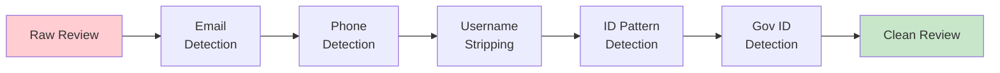

---

### 2.2 Data Storage Layer

GrowwPulse uses a **file-based storage model** — no external database is required. All data lives in the project's `data/` directory.

#### 2.2.1 Storage Architecture

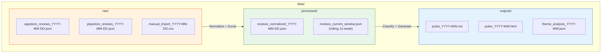

#### 2.2.2 Review Schema Definition

```json
{
  "$schema": "http://json-schema.org/draft-07/schema#",
  "title": "GrowwPulse Review",
  "type": "object",
  "required": ["id", "rating", "text", "date", "source"],
  "properties": {
    "id": {
      "type": "string",
      "description": "SHA-256 hash for deduplication"
    },
    "rating": {
      "type": "integer",
      "minimum": 1,
      "maximum": 5
    },
    "title": {
      "type": ["string", "null"]
    },
    "text": {
      "type": "string",
      "minLength": 1
    },
    "date": {
      "type": "string",
      "format": "date"
    },
    "source": {
      "type": "string",
      "enum": ["app_store", "play_store"]
    },
    "ingested_at": {
      "type": "string",
      "format": "date-time"
    },
    "word_count": {
      "type": "integer",
      "minimum": 0
    }
  }
}
```

#### 2.2.3 Data Retention Policy

| Policy | Detail |
|:---|:---|
| **Active Window** | Rolling 12-week window of reviews used for weekly analysis |
| **Raw Data Retention** | Raw files kept for 26 weeks (6 months) for audit/debugging |
| **Processed Data Retention** | `reviews_current_window.json` is rebuilt each run; old snapshots archived |
| **Output Retention** | All generated pulse notes and theme analyses are retained indefinitely |
| **Cleanup Mechanism** | Pipeline startup phase prunes files older than retention window |

---

### 2.3 Theme Classification Engine

The classification engine groups reviews into a maximum of **5 actionable themes** using a hybrid approach: keyword-based clustering seeded with domain knowledge, refined by LLM-assisted extraction.

#### 2.3.1 Classification Architecture

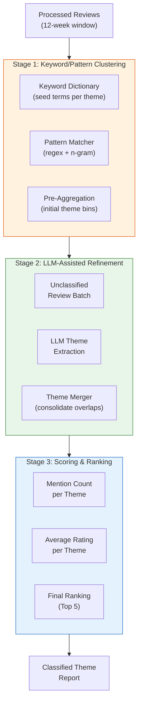

#### 2.3.2 Keyword/Pattern-Based Clustering

**Seed Keyword Dictionary:**

| Theme | Seed Keywords / Phrases |
|:---|:---|
| **App Stability & Performance** | `crash`, `lag`, `slow`, `freeze`, `hang`, `server down`, `not loading`, `blank screen`, `OTP not received`, `app not opening`, `glitch`, `bug` |
| **Customer Support** | `support`, `helpline`, `no response`, `ticket`, `complaint`, `customer care`, `chat bot`, `not helpful`, `escalate`, `resolve` |
| **UX / Interface** | `UI`, `UX`, `confusing`, `cluttered`, `navigation`, `design`, `difficult to find`, `too many`, `layout`, `dark mode`, `update ruined` |
| **Transactions & Orders** | `order failed`, `payment stuck`, `withdrawal`, `fund transfer`, `money deducted`, `wrong amount`, `execution delay`, `SIP`, `redemption` |
| **Onboarding & KYC** | `KYC`, `verification`, `sign up`, `register`, `Aadhaar`, `PAN`, `NRI`, `account open`, `document upload`, `rejected` |

**Matching Algorithm:**
1. Tokenize review text (lowercase, remove stopwords)
2. Match against seed keywords using exact match + stemmed variants
3. Assign reviews to the theme with the highest keyword overlap score
4. Reviews matching zero keywords → routed to LLM-assisted extraction

#### 2.3.3 LLM-Assisted Theme Extraction

For reviews that don't match seed keywords (typically 20–30% of the corpus), the AI agent uses its own reasoning capabilities:

| Aspect | Detail |
|:---|:---|
| **LLM Provider** | Groq (`llama-3.3-70b-versatile`) |
| **Rate Limit Constraints** | 30 RPM, 1K RPD, 12K TPM, 100K TPD |
| **Input Optimization** | • Only critical reviews (1-3★) are sent to LLM.<br/>• Reviews already classified by keywords are skipped.<br/>• Hard cap of max 150 LLM reviews per run (stratified sampling if exceeded). |
| **Batching & Execution** | Batch size: 30–50 reviews. Batches run sequentially with a 5-second cooldown to respect TPM/RPM. |
| **Prompt Strategy** | Concise prompt enforcing a compressed JSON structure to minimize output tokens. |
| **Output** | Theme assignment per review + confidence score |
| **New Theme Handling** | If a new theme clusters ≥15 reviews, it replaces the lowest-ranked existing theme (maintaining max 5 cap) |
| **Consistency Check** | LLM classifications are cross-validated against keyword clusters to prevent drift |

#### 2.3.4 Theme Taxonomy

The system maintains a **dynamic but bounded** taxonomy:

```
Maximum Themes: 5
Default Themes (based on Groww review corpus 2025-2026):

  1. App Stability & Performance
  2. Customer Support
  3. UX / Interface
  4. Transactions & Order Execution
  5. Onboarding & KYC
```

> **Note:** Themes are re-derived weekly from actual review data. The defaults above are seeds, not hardcoded values. If user sentiment shifts (e.g., a new "Pricing & Fees" theme emerges), the taxonomy adapts.

#### 2.3.5 Theme Scoring

Each theme is scored along two dimensions:

| Metric | Calculation | Purpose |
|:---|:---|:---|
| **Mention Count** | Number of reviews assigned to theme | Indicates volume / prevalence |
| **Average Rating** | Mean star rating of reviews in theme | Indicates severity (lower = more painful) |
| **Composite Score** | `mention_count × (6 - avg_rating)` | Ranks themes by impact (high volume + low rating = top priority) |

**Theme Output Schema:**
```json
{
  "theme": "App Stability & Performance",
  "mention_count": 87,
  "avg_rating": 1.8,
  "composite_score": 365.4,
  "top_keywords": ["crash", "lag", "server down"],
  "sample_review_ids": ["a1b2c3...", "d4e5f6..."]
}
```

---

### 2.4 Pulse Note Generator

The generator transforms classified theme data and selected quotes into the final **≤250-word weekly pulse note**.

#### 2.4.1 Generator Architecture

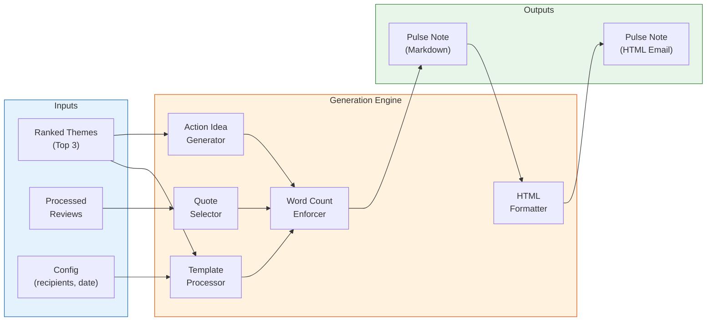

#### 2.4.2 Template Engine

The pulse note follows a fixed template structure:

```
📊 GrowwPulse — Weekly Review Digest
Week of [START_DATE] – [END_DATE]

━━━━━━━━━━━━━━━━━━━━━━━━━━━━━━━━━

🔥 TOP THEMES THIS WEEK
1. [Theme 1] — [N mentions, avg rating X★]
2. [Theme 2] — [N mentions, avg rating X★]
3. [Theme 3] — [N mentions, avg rating X★]

━━━━━━━━━━━━━━━━━━━━━━━━━━━━━━━━━

💬 USER VOICES (Anonymized)
• "[Quote 1]" — ★X, [Source]
• "[Quote 2]" — ★X, [Source]
• "[Quote 3]" — ★X, [Source]

━━━━━━━━━━━━━━━━━━━━━━━━━━━━━━━━━

💡 ACTION IDEAS
1. [Recommendation based on Theme 1]
2. [Recommendation based on Theme 2]
3. [Recommendation based on Theme 3]

━━━━━━━━━━━━━━━━━━━━━━━━━━━━━━━━━
Reviews analyzed: [N] | Period: [DATE_RANGE] | Sources: App Store, Play Store
```

#### 2.4.3 Quote Selector

The quote selector picks **3 representative quotes** using a diversity-aware algorithm:

| Selection Criterion | Weight | Description |
|:---|:---|:---|
| **Theme Coverage** | 40% | Each quote should represent a different top theme |
| **Specificity** | 25% | Prefer quotes with concrete details (not generic "bad app") |
| **Length** | 20% | Prefer 15–50 word quotes (long enough to be meaningful, short enough for the budget) |
| **Rating Spread** | 15% | Include at least one low-rating (1–2★) and one mid-rating (3★) quote |

**Quote Selection Flow:**
1. Pool all reviews from the top 3 themes
2. Filter: word count 10–60, no PII flags, coherent language
3. Score each candidate on the criteria above
4. Select top-scoring quote from each of the 3 themes
5. Verify combined quote word count stays within budget

#### 2.4.4 Action Idea Generator

Each action idea is derived from its corresponding theme:

| Input | Process | Output Example |
|:---|:---|:---|
| Theme: "App Stability" with keywords `crash`, `lag`, `market hours` | Identify specific failure patterns | "Prioritize load-testing order execution paths during market hours (9:15–10:00 AM) to reduce crash-related 1★ reviews." |
| Theme: "Customer Support" with keywords `no response`, `ticket` | Identify service gaps | "Implement ticket-status SMS notifications to reduce 'no response' complaints (currently 23% of support-themed reviews)." |
| Theme: "UX / Interface" with keywords `cluttered`, `confusing` | Identify design friction points | "Conduct a navigation audit on the portfolio dashboard — 15 reviews cited difficulty finding SIP status." |

#### 2.4.5 Word Count Enforcer

| Rule | Implementation |
|:---|:---|
| **Hard Limit** | ≤250 words total (header, themes, quotes, actions, footer) |
| **Counting Method** | Split on whitespace; emojis count as 1 word; numbers count as 1 word |
| **Overflow Strategy** | Truncate action ideas first → shorten quotes → reduce to top 2 themes |
| **Validation** | Final word count is logged and embedded in the output metadata |

---

### 2.5 MCP Integration Layer

The MCP layer provides the bridge between the GrowwPulse pipeline and external Google Workspace services. All interactions with Gmail and Google Docs flow through MCP — no direct API client code exists in the application.

#### 2.5.1 MCP Integration Architecture

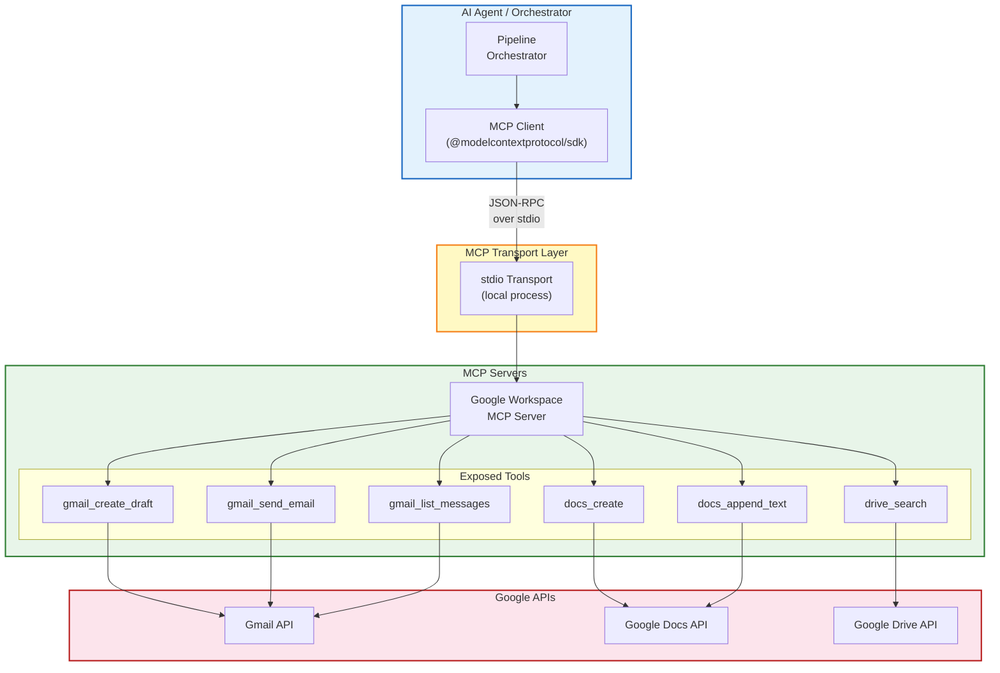

#### 2.5.2 MCP Client Configuration

The MCP client is configured through the AI agent's settings file (e.g., `claude_desktop_config.json` or `settings.json`):

```json
{
  "mcpServers": {
    "google-workspace": {
      "command": "npx",
      "args": ["-y", "@anthropic/google-workspace-mcp"],
      "env": {
        "GOOGLE_CLIENT_ID": "${GOOGLE_CLIENT_ID}",
        "GOOGLE_CLIENT_SECRET": "${GOOGLE_CLIENT_SECRET}",
        "GOOGLE_REFRESH_TOKEN": "${GOOGLE_REFRESH_TOKEN}"
      }
    }
  }
}
```

**Connection Lifecycle:**
1. Agent starts → MCP client reads server config
2. Client spawns MCP server process via `npx`
3. Client and server establish JSON-RPC communication over `stdio`
4. Client discovers available tools via `tools/list` RPC call
5. Agent invokes tools as needed during pipeline execution
6. On agent shutdown → server process is terminated gracefully

#### 2.5.3 Gmail MCP Server Interface

| Tool | Parameters | Returns | Usage in GrowwPulse |
|:---|:---|:---|:---|
| `gmail_create_draft` | `to: string`, `subject: string`, `body: string (HTML)`, `cc?: string` | `{ draftId: string, messageId: string }` | Create the weekly pulse email as a draft for review before sending |
| `gmail_send_email` | `to: string`, `subject: string`, `body: string (HTML)`, `cc?: string` | `{ messageId: string, threadId: string }` | Send the pulse directly to recipients (used when auto-send is enabled) |
| `gmail_list_messages` | `query: string`, `maxResults?: number` | `{ messages: [{ id, threadId, snippet }] }` | Check if a pulse for the current week was already sent (idempotency guard) |

**Email Subject Format:**
```
📊 GrowwPulse — Weekly Review Digest (Week of May 12–18, 2026)
```

#### 2.5.4 Google Docs MCP Server Interface

| Tool | Parameters | Returns | Usage in GrowwPulse |
|:---|:---|:---|:---|
| `docs_create` | `title: string`, `content?: string` | `{ documentId: string, documentUrl: string }` | Create a new Google Doc with the pulse note (standalone or weekly archive) |
| `docs_append_text` | `documentId: string`, `text: string` | `{ success: boolean }` | Append weekly pulse to a running "GrowwPulse Archive" doc |
| `drive_search` | `query: string` | `{ files: [{ id, name, mimeType }] }` | Find existing pulse archive doc before appending |

#### 2.5.5 Email HTML Formatter

The formatter converts the markdown pulse note into styled HTML for email delivery:

| Element | HTML Treatment |
|:---|:---|
| Section headers | `<h2>` with brand-consistent color (`#00d09c` Groww green) |
| Theme list | `<ol>` with bold theme names, inline rating badges |
| User quotes | `<blockquote>` with left-border accent, italic text |
| Action ideas | `<ol>` with numbered items, actionable verb-first phrasing |
| Dividers | `<hr>` styled with dotted border |
| Footer | `<p>` with muted gray text, smaller font size |

#### 2.5.6 Error Handling & Retry Logic

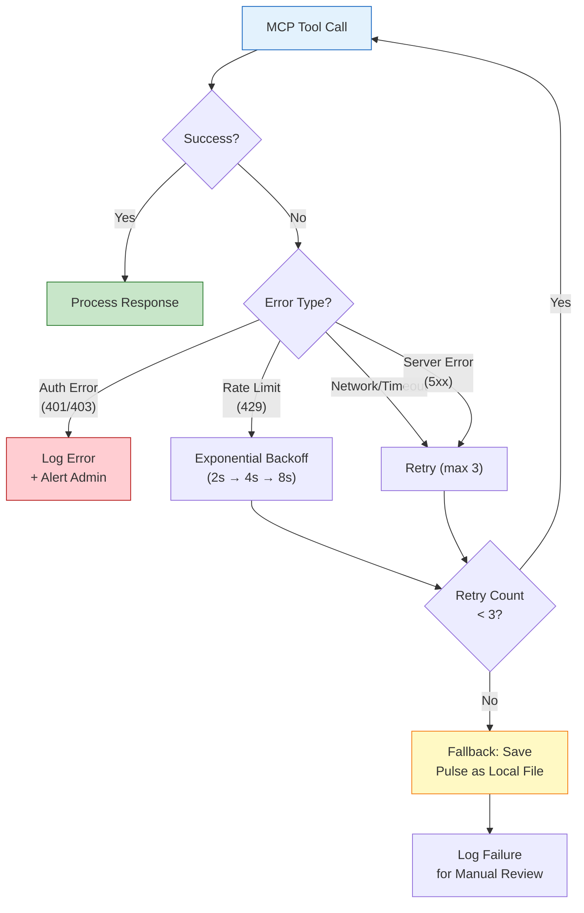

**Retry Policy:**

| Error Category | Max Retries | Backoff | Fallback |
|:---|:---|:---|:---|
| Authentication (401/403) | 0 | N/A | Log error; prompt for credential refresh |
| Rate Limiting (429) | 3 | Exponential (2s, 4s, 8s) | Save locally; retry on next run |
| Network Timeout | 3 | Linear (5s) | Save locally; alert admin |
| Server Error (5xx) | 3 | Exponential (2s, 4s, 8s) | Save locally; retry on next run |
| Invalid Request (4xx) | 0 | N/A | Log payload for debugging |

---

### 2.6 Orchestration Layer

The orchestration layer coordinates all components into a cohesive pipeline, manages configuration, and maintains an audit trail.

#### 2.6.1 AI Agent Orchestrator

The orchestrator is the **AI agent itself** — it coordinates the pipeline end-to-end using its reasoning capabilities and the tools available to it.

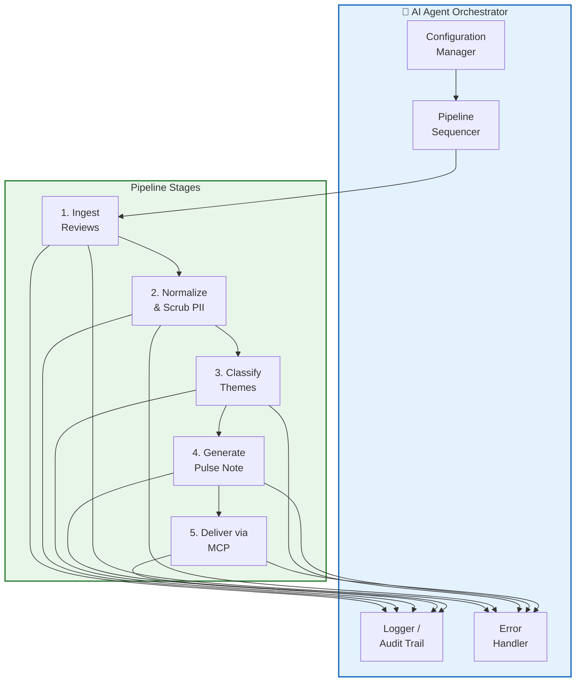

#### 2.6.2 Pipeline Execution Flow

| Stage | Input | Output | Duration (est.) |
|:---|:---|:---|:---|
| **1. Ingest** | Review source URLs / file paths | `data/raw/*.json` | 10–30s |
| **2. Normalize & Scrub** | Raw review files | `data/processed/reviews_current_window.json` | 2–5s |
| **3. Classify** | Normalized reviews | `data/outputs/theme_analysis_YYYY-WW.json` | 5–15s |
| **4. Generate** | Theme analysis + processed reviews | `data/outputs/pulse_YYYY-WW.md` + `.html` | 3–8s |
| **5. Deliver** | HTML pulse note + config (recipients) | Gmail draft / sent email + optional Google Doc | 5–10s |

**Total estimated pipeline duration: 25–70 seconds**

#### 2.6.3 Configuration Management

Configuration is stored in `config/settings.json`:

```json
{
  "pipeline": {
    "review_window_weeks": 12,
    "max_themes": 5,
    "top_themes_in_pulse": 3,
    "max_pulse_words": 250,
    "quotes_count": 3,
    "action_ideas_count": 3
  },
  "sources": {
    "appstore": {
      "enabled": true,
      "app_id": "1404871703",
      "max_pages": 10
    },
    "playstore": {
      "enabled": true,
      "package_id": "com.nextbillion.groww"
    },
    "csv_import": {
      "enabled": false,
      "file_path": "data/raw/manual_import.csv"
    }
  },
  "delivery": {
    "email": {
      "enabled": true,
      "recipients": ["team@example.com"],
      "cc": [],
      "auto_send": false
    },
    "google_docs": {
      "enabled": false,
      "archive_doc_title": "GrowwPulse — Weekly Archive 2026"
    }
  },
  "theme_seeds": {
    "App Stability & Performance": ["crash", "lag", "slow", "freeze", "server down"],
    "Customer Support": ["support", "helpline", "no response", "complaint"],
    "UX / Interface": ["UI", "UX", "confusing", "cluttered", "navigation"],
    "Transactions & Orders": ["order failed", "payment stuck", "withdrawal"],
    "Onboarding & KYC": ["KYC", "verification", "sign up", "Aadhaar", "PAN"]
  }
}
```

#### 2.6.4 Logging & Audit Trail

| Log Type | Location | Content |
|:---|:---|:---|
| **Pipeline Run Log** | `data/outputs/run_log_YYYY-WW.json` | Timestamp, stage durations, review counts, errors |
| **Ingestion Log** | Embedded in run log | Sources fetched, reviews per source, HTTP status codes |
| **Classification Log** | Embedded in run log | Theme distribution, unclassified count, LLM calls made |
| **Delivery Log** | Embedded in run log | MCP tool calls, draft/message IDs, success/failure status |

**Run Log Schema:**
```json
{
  "run_id": "2026-W21-001",
  "started_at": "2026-05-21T07:00:00Z",
  "completed_at": "2026-05-21T07:00:45Z",
  "status": "success",
  "stages": {
    "ingest": { "duration_ms": 15200, "reviews_fetched": 342 },
    "normalize": { "duration_ms": 2100, "reviews_after_dedup": 318, "pii_scrubbed": 7 },
    "classify": { "duration_ms": 8400, "themes_generated": 5 },
    "generate": { "duration_ms": 4300, "word_count": 237 },
    "deliver": { "duration_ms": 6800, "draft_id": "r-1234567890", "doc_id": null }
  },
  "errors": []
}
```

---

## 3. Data Flow Diagram

### 3.1 Detailed Sequence Diagram — Happy Path

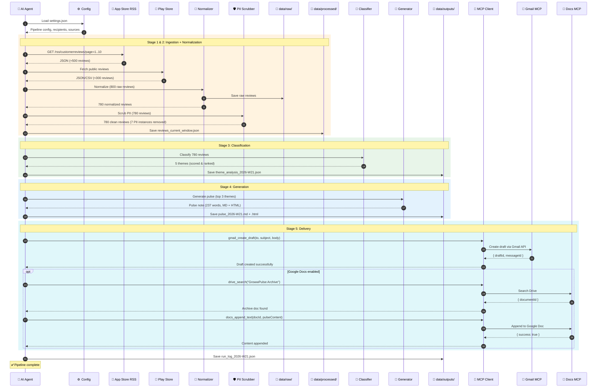

### 3.2 Error Path Diagram

```mermaid
sequenceDiagram
    autonumber
    participant Agent as 🤖 AI Agent
    participant Source as 📱 Review Source
    participant MCP as 🔌 MCP Client
    participant Gmail as 📧 Gmail MCP
    participant Fallback as 💾 Local Fallback

    rect rgb(255, 205, 210)
    Note over Agent, Source: Error Path A: Ingestion Failure
    Agent->>Source: Fetch reviews
    Source-->>Agent: HTTP 503 Service Unavailable
    Agent->>Source: Retry 1 (after 2s)
    Source-->>Agent: HTTP 503
    Agent->>Source: Retry 2 (after 4s)
    Source-->>Agent: HTTP 503
    Agent->>Agent: Fall back to cached data/processed/ if available
    Note over Agent: Continue with stale data OR abort with logged error
    end

    rect rgb(255, 249, 196)
    Note over Agent, Fallback: Error Path B: MCP Delivery Failure
    Agent->>MCP: gmail_create_draft(to, subject, body)
    MCP->>Gmail: Create draft
    Gmail-->>MCP: 401 Unauthorized
    MCP-->>Agent: Auth error
    Agent->>Agent: Token refresh not possible via MCP
    Agent->>Fallback: Save pulse_2026-W21.html locally
    Agent->>Agent: Log error + alert for manual credential refresh
    Note over Agent: Pulse saved locally; email delivery pending
    end

    rect rgb(243, 229, 245)
    Note over Agent, Fallback: Error Path C: Partial Failure
    Agent->>MCP: gmail_send_email(...)
    MCP->>Gmail: Send email
    Gmail-->>MCP: 429 Rate Limited
    MCP-->>Agent: Rate limit error
    Agent->>Agent: Wait 2s (backoff)
    Agent->>MCP: gmail_send_email(...) retry
    MCP->>Gmail: Send email
    Gmail-->>MCP: 200 OK
    MCP-->>Agent: Email sent
    Note over Agent: ✅ Recovered after retry
    end
```

---

## 4. MCP Architecture Deep Dive

### 4.1 How MCP Servers Are Configured and Connected

MCP follows a **client-server architecture** where the AI agent (host application) manages MCP clients that connect to MCP servers.

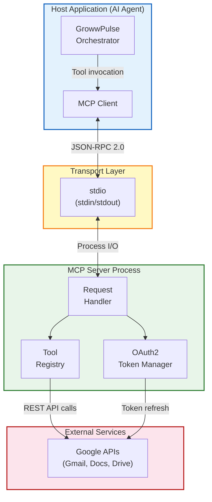

**Connection Sequence:**

1. Agent reads MCP server configuration from `settings.json`
2. Agent spawns the MCP server as a child process (`npx -y @anthropic/google-workspace-mcp`)
3. Environment variables (`GOOGLE_CLIENT_ID`, `GOOGLE_CLIENT_SECRET`, `GOOGLE_REFRESH_TOKEN`) are passed to the server process
4. Client and server perform the **MCP initialization handshake** via JSON-RPC over `stdio`
5. Server advertises its capabilities and available tools
6. Client is now ready to invoke tools on behalf of the agent

### 4.2 MCP Tool Catalog

Complete catalog of all MCP tools used by GrowwPulse:

| Tool | Server | Parameters | Return Type | Required | Description |
|:---|:---|:---|:---|:---|:---|
| `gmail_create_draft` | Google Workspace | `to: string`<br/>`subject: string`<br/>`body: string`<br/>`cc?: string`<br/>`bcc?: string` | `{ draftId, messageId }` | ✅ | Create a Gmail draft with the weekly pulse |
| `gmail_send_email` | Google Workspace | `to: string`<br/>`subject: string`<br/>`body: string`<br/>`cc?: string` | `{ messageId, threadId }` | ✅ | Send the pulse email directly |
| `gmail_list_messages` | Google Workspace | `query: string`<br/>`maxResults?: number` | `{ messages: [] }` | ⬜ | Idempotency check: verify if pulse was already sent |
| `docs_create` | Google Workspace | `title: string`<br/>`content?: string` | `{ documentId, documentUrl }` | ⬜ | Create a Google Doc version of the pulse |
| `docs_append_text` | Google Workspace | `documentId: string`<br/>`text: string` | `{ success: boolean }` | ⬜ | Append pulse to a running archive document |
| `drive_search` | Google Workspace | `query: string` | `{ files: [] }` | ⬜ | Find existing archive docs before appending |

### 4.3 Authentication Flow

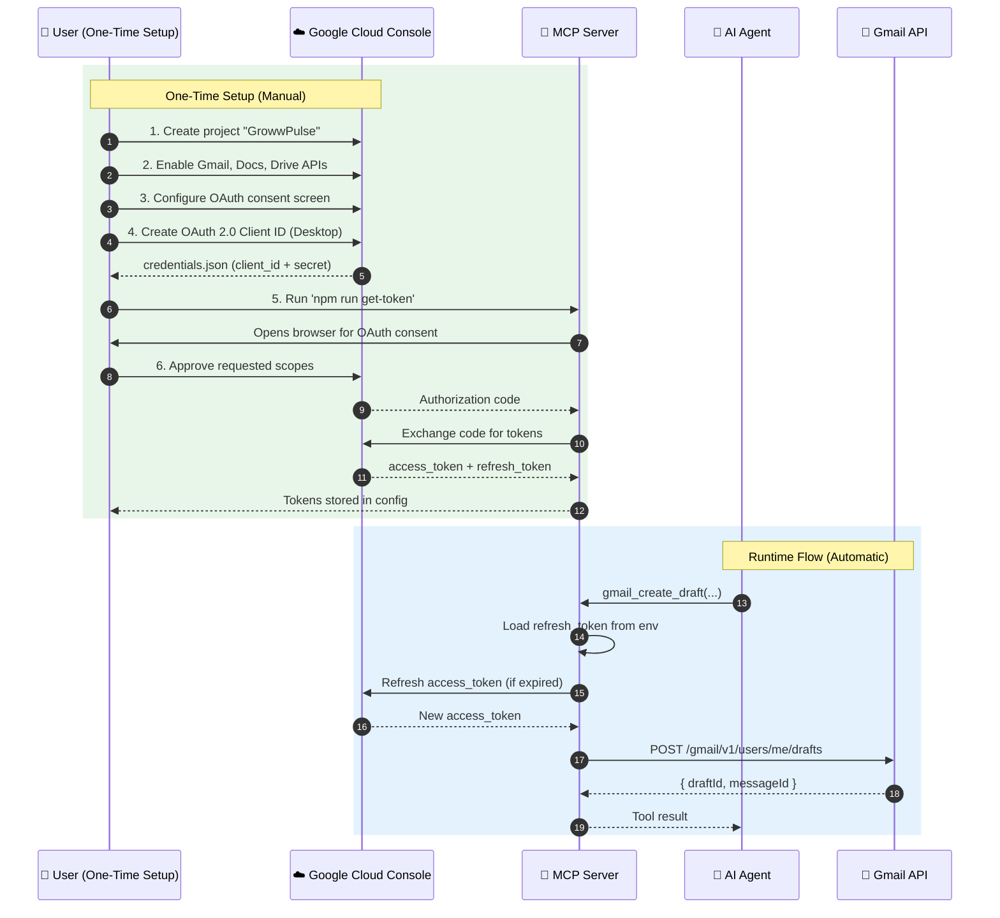

### 4.4 Security Model

| Security Aspect | Implementation |
|:---|:---|
| **Credential Isolation** | OAuth tokens stored exclusively in MCP server environment variables; never in application code or version control |
| **Scope Minimization** | Only `gmail.compose`, `gmail.readonly`, `documents`, and `drive.file` scopes requested — no full Gmail access |
| **Token Rotation** | MCP server automatically refreshes access tokens using the stored refresh token; no manual intervention |
| **Transport Security** | MCP client-server communication uses `stdio` (in-process) — no network exposure |
| **Audit Logging** | All MCP tool invocations are logged with timestamps, parameters (PII-free), and results |
| **No Credential Leakage** | Pipeline code never has access to raw OAuth tokens; only interacts with MCP tools |

### 4.5 MCP Communication Flow

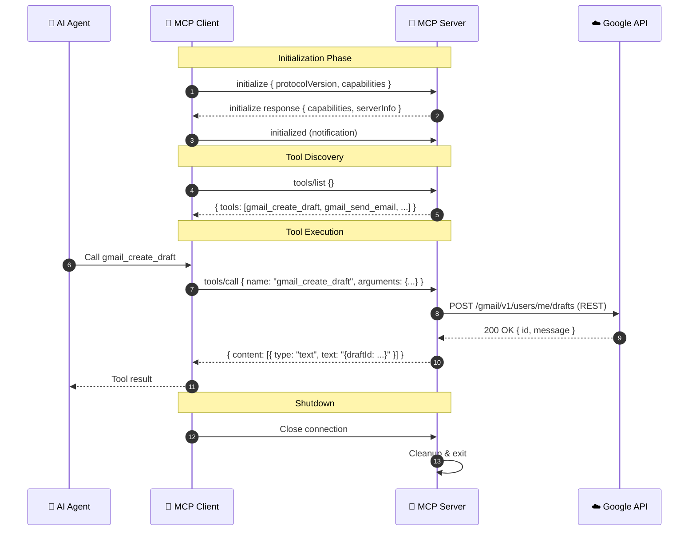

---

## 5. Directory Structure

```
c:\growwpulse\
│
├── 📁 Docs/                           # Project documentation
│   ├── Problem.Statment.md            # Problem statement & scope
│   └── architecture.md                # This architecture document
│
├── 📁 data/                           # All data files
│   ├── 📁 raw/                        # Raw review data (pre-normalization)
│   │   ├── appstore_reviews_2026-05-21.json
│   │   ├── playstore_reviews_2026-05-21.json
│   │   └── manual_import.csv
│   │
│   ├── 📁 processed/                  # Normalized, PII-scrubbed reviews
│   │   ├── reviews_normalized_2026-05-21.json
│   │   └── reviews_current_window.json    # Rolling 12-week active dataset
│   │
│   └── 📁 outputs/                    # Generated artifacts
│       ├── pulse_2026-W21.md          # Weekly pulse note (Markdown)
│       ├── pulse_2026-W21.html        # Weekly pulse note (HTML email)
│       ├── theme_analysis_2026-W21.json   # Theme classification results
│       └── run_log_2026-W21.json      # Pipeline execution log
│
├── 📁 src/                            # Source code
│   ├── 📁 ingestion/                  # Review data fetchers
│   │   ├── appstore_connector.js      # Apple RSS feed connector
│   │   ├── playstore_connector.js     # Google Play data connector
│   │   ├── csv_adapter.js             # CSV/JSON import adapter
│   │   ├── normalizer.js              # Review schema normalizer
│   │   └── pii_scrubber.js            # PII detection & removal
│   │
│   ├── 📁 classification/            # Theme classification engine
│   │   ├── keyword_classifier.js      # Keyword/pattern-based clustering
│   │   ├── llm_classifier.js          # LLM-assisted theme extraction
│   │   ├── theme_scorer.js            # Theme scoring & ranking
│   │   └── taxonomy.js                # Theme taxonomy management
│   │
│   ├── 📁 generator/                  # Pulse note builder
│   │   ├── template_engine.js         # Markdown template processor
│   │   ├── quote_selector.js          # Representative quote picker
│   │   ├── action_generator.js        # Action idea generator
│   │   ├── word_counter.js            # Word count enforcer
│   │   └── html_formatter.js          # Markdown → HTML email converter
│   │
│   └── 📁 delivery/                   # MCP-based delivery
│       ├── mcp_client.js              # MCP client wrapper
│       ├── gmail_delivery.js          # Gmail draft/send via MCP
│       └── docs_delivery.js           # Google Docs creation via MCP
│
├── 📁 config/                         # Configuration files
│   ├── settings.json                  # Pipeline configuration
│   ├── mcp_config.json                # MCP server configuration
│   └── theme_seeds.json               # Seed keywords for classification
│
├── 📁 templates/                      # Note & email templates
│   ├── pulse_template.md              # Markdown pulse note template
│   └── email_template.html            # HTML email template with styles
│
├── 📁 tests/                          # Test files
│   ├── 📁 fixtures/                   # Test data fixtures
│   │   ├── sample_appstore_reviews.json
│   │   ├── sample_playstore_reviews.json
│   │   └── sample_normalized_reviews.json
│   ├── ingestion.test.js              # Ingestion layer tests
│   ├── classification.test.js         # Classification engine tests
│   ├── generator.test.js              # Pulse generator tests
│   └── delivery.test.js               # MCP delivery tests
│
├── package.json                       # Node.js project manifest
├── .gitignore                         # Git ignore rules
└── README.md                          # Project README
```

### Directory Responsibilities

| Directory | Purpose | Key Files |
|:---|:---|:---|
| `Docs/` | Project documentation & architecture | `architecture.md`, `Problem.Statment.md` |
| `data/raw/` | Unprocessed review data as fetched from sources | Timestamped JSON/CSV files |
| `data/processed/` | Normalized, PII-scrubbed, deduplicated reviews | `reviews_current_window.json` |
| `data/outputs/` | All generated artifacts — pulses, analyses, logs | Weekly pulse notes (MD + HTML), theme analyses |
| `src/ingestion/` | Source connectors, normalization, PII scrubbing | Connector modules, normalizer, scrubber |
| `src/classification/` | Theme classification and scoring | Keyword + LLM classifiers, scorer |
| `src/generator/` | Pulse note construction | Template engine, quote selector, word counter |
| `src/delivery/` | MCP integration for email and docs | Gmail and Docs MCP wrappers |
| `config/` | Runtime configuration | Pipeline settings, MCP config, theme seeds |
| `templates/` | Note and email templates | Markdown and HTML templates |
| `tests/` | Test suites and fixtures | Unit and integration tests |

---

## 6. Technology Stack

### 6.1 Stack Overview

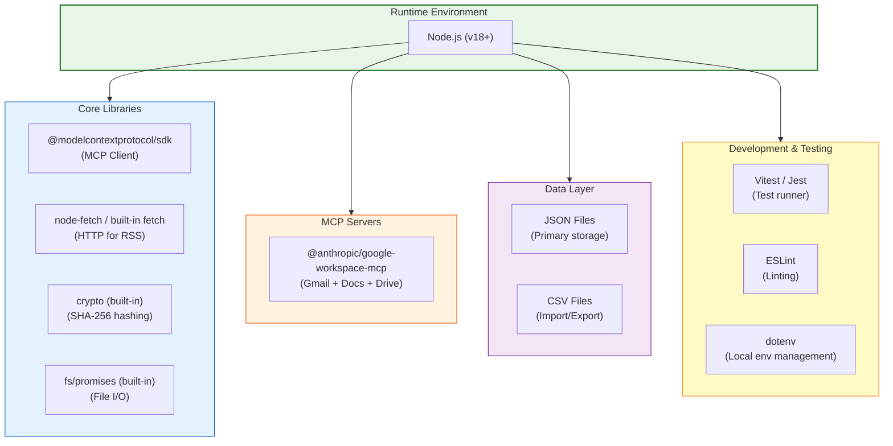

### 6.2 Detailed Technology Choices

| Layer | Technology | Rationale |
|:---|:---|:---|
| **Runtime** | Node.js (v18+) | Native MCP SDK ecosystem alignment; built-in `fetch`; excellent JSON handling |
| **MCP Client** | `@modelcontextprotocol/sdk` | Official MCP SDK for client-server communication |
| **MCP Server** | `@anthropic/google-workspace-mcp` | Community-maintained Google Workspace integration (Gmail, Docs, Drive) |
| **HTTP Client** | Built-in `fetch` (Node 18+) | No external dependency needed for RSS feed fetching |
| **File I/O** | `fs/promises` (built-in) | Async file operations for JSON/CSV read/write |
| **Hashing** | `crypto` (built-in) | SHA-256 for review ID generation and deduplication |
| **CSV Parsing** | `csv-parse` / `papaparse` | Robust CSV handling with UTF-8 and edge case support |
| **HTML Templating** | Template literals / `handlebars` | Convert markdown pulse to styled HTML email body |
| **Testing** | Vitest or Jest | Fast test runner with good mocking support |
| **Linting** | ESLint | Code quality and consistency |
| **Environment** | `dotenv` (dev only) | Local environment variable management for development |

### 6.3 Why Node.js Over Python?

| Factor | Node.js ✅ | Python |
|:---|:---|:---|
| **MCP Ecosystem** | First-class SDK support; most MCP servers are Node.js packages | SDK available but fewer community servers |
| **MCP Server Install** | `npx -y @package` — zero setup | Requires pip install + virtual env management |
| **JSON Handling** | Native; JSON is a first-class citizen | Requires `json` module; less ergonomic |
| **Async I/O** | Built-in `async/await` with event loop | `asyncio` requires explicit setup |
| **Package Ecosystem** | npm has most Google Workspace MCP servers | Fewer MCP packages on PyPI |
| **Deployment** | Single `node` binary + `package.json` | Requires Python + pip + venv |

> **Recommendation:** Use **Node.js** for this project due to its alignment with the MCP ecosystem. All major MCP servers (Google Workspace, GitHub, Slack) are distributed as npm packages.

---

## 7. Security & Privacy Architecture

### 7.1 Security Architecture Overview

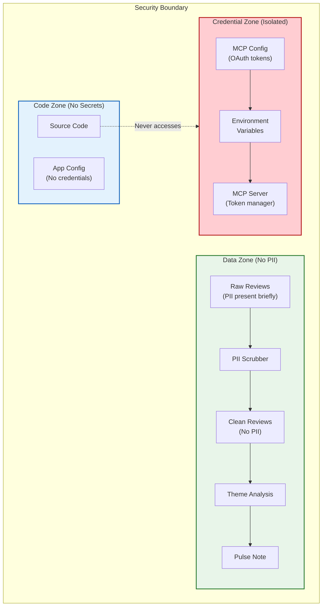

### 7.2 PII Detection and Scrubbing Pipeline

| Stage | Action | Details |
|:---|:---|:---|
| **1. Author Stripping** | Remove `author` / `userName` fields | Dropped immediately upon normalization; never written to processed files |
| **2. Email Detection** | Regex scan for email patterns | `user@domain.com` → `[EMAIL_REDACTED]` |
| **3. Phone Detection** | Regex scan for phone patterns | Indian mobile, international formats → `[PHONE_REDACTED]` |
| **4. ID Detection** | Regex scan for account/user IDs | Long alphanumeric strings → `[ID_REDACTED]` |
| **5. Gov ID Detection** | India-specific patterns (Aadhaar, PAN) | 12-digit sequences, `ABCDE1234F` patterns → `[GOV_ID_REDACTED]` |
| **6. Validation** | Second-pass scan of scrubbed output | Ensures no PII patterns remain; logs any near-matches for manual review |

### 7.3 Credential Management

| Credential | Storage Location | Access Method | Rotation Policy |
|:---|:---|:---|:---|
| Google OAuth Client ID | MCP server env var | `GOOGLE_CLIENT_ID` | Static; rotate if compromised |
| Google OAuth Client Secret | MCP server env var | `GOOGLE_CLIENT_SECRET` | Static; rotate if compromised |
| Google Refresh Token | MCP server env var | `GOOGLE_REFRESH_TOKEN` | Auto-managed by MCP server; re-auth if revoked |
| Google Access Token | MCP server memory (runtime only) | Never stored on disk | Auto-refreshed every 60 minutes by MCP server |

### 7.4 Data Minimization Principles

| Principle | Implementation |
|:---|:---|
| **Collect Only What's Needed** | Only `rating`, `title`, `text`, `date`, `source` are retained from reviews |
| **Scrub at Ingestion** | PII is removed before data reaches `data/processed/`; raw files are temporary |
| **No User Tracking** | No user IDs, device fingerprints, or session data are stored |
| **Time-Limited Retention** | Rolling 12-week window; raw data purged after 26 weeks |
| **Minimal API Scopes** | Only `gmail.compose`, `gmail.readonly`, `documents`, `drive.file` requested |
| **No Third-Party Analytics** | No review data is sent to external analytics platforms |

### 7.5 Files Excluded from Version Control

`.gitignore` must include:

```
# Credentials & tokens
config/mcp_config.json
.env
credentials.json
token.json

# Raw data (may contain pre-scrub PII)
data/raw/

# Node modules
node_modules/

# OS files
.DS_Store
Thumbs.db
```

---

## 8. Scalability & Future Considerations

### 8.1 Evolution Roadmap

```mermaid
graph LR
    subgraph V1["v1.0 — Current"]
        A1["Single product<br/>(Groww)"]
        A2["Email delivery<br/>(Gmail)"]
        A3["Weekly manual<br/>trigger"]
        A4["File-based<br/>storage"]
    end

    subgraph V2["v2.0 — Near-Term"]
        B1["Multi-product<br/>support"]
        B2["Slack / Teams<br/>delivery"]
        B3["Automated<br/>cron scheduling"]
        B4["Historical trend<br/>tracking"]
    end

    subgraph V3["v3.0 — Future"]
        C1["Real-time<br/>monitoring"]
        C2["Dashboard<br/>UI"]
        C3["ML-powered<br/>classification"]
        C4["Database<br/>storage"]
    end

    V1 --> V2
    V2 --> V3

    style V1 fill:#e8f5e9,stroke:#2e7d32,stroke-width:2px
    style V2 fill:#fff3e0,stroke:#e65100,stroke-width:2px
    style V3 fill:#e3f2fd,stroke:#1565c0,stroke-width:2px
```

### 8.2 Multi-Product Support (v2.0)

| Aspect | Current (v1.0) | Future (v2.0) |
|:---|:---|:---|
| **App Configuration** | Single hardcoded `app_id` | Array of products in `settings.json` with per-product config |
| **Directory Structure** | Flat `data/` directory | `data/{product_name}/raw/`, `data/{product_name}/processed/` |
| **Theme Taxonomy** | Shared across all reviews | Per-product theme seeds and taxonomy |
| **Pulse Note** | Single note | Per-product notes OR consolidated multi-product digest |
| **Email Delivery** | One recipient list | Per-product recipient lists |

**Proposed Multi-Product Config:**
```json
{
  "products": [
    {
      "name": "Groww",
      "appstore_id": "1404871703",
      "playstore_id": "com.nextbillion.groww",
      "recipients": ["groww-team@example.com"]
    },
    {
      "name": "Zerodha",
      "appstore_id": "1461655338",
      "playstore_id": "com.zerodha.kite3",
      "recipients": ["zerodha-team@example.com"]
    }
  ]
}
```

### 8.3 Slack / Teams Delivery Channels (v2.0)

| Channel | MCP Server | Tool | Status |
|:---|:---|:---|:---|
| **Gmail** | `@anthropic/google-workspace-mcp` | `gmail_create_draft`, `gmail_send_email` | ✅ Implemented (v1.0) |
| **Slack** | `@anthropic/slack-mcp` | `slack_post_message` | 🔮 Planned (v2.0) |
| **Microsoft Teams** | Community MCP servers | `teams_send_message` | 🔮 Planned (v2.0) |
| **Webhook** | Custom MCP server | `webhook_post` | 🔮 Planned (v2.0) |

### 8.4 Historical Trend Dashboards (v3.0)

| Feature | Description |
|:---|:---|
| **Trend Graphs** | Week-over-week theme mention counts and rating trends |
| **Sentiment Timeline** | Rolling average sentiment score over 12–52 weeks |
| **Comparative Analysis** | Cross-product theme comparison (requires multi-product support) |
| **Alert Thresholds** | Auto-flag when a theme's mention count spikes >2× week-over-week |
| **Implementation** | Static HTML dashboard generated from `data/outputs/` history; no server required |

### 8.5 Automated Scheduling (v2.0)

**Cron-Based Weekly Runs:**

| Platform | Mechanism | Schedule |
|:---|:---|:---|
| **Windows** | Task Scheduler | Every Monday 8:00 AM |
| **macOS / Linux** | `crontab` | `0 8 * * 1 node /path/to/pipeline.js` |
| **CI/CD** | GitHub Actions scheduled workflow | `cron: '0 8 * * 1'` |
| **Cloud** | AWS Lambda + EventBridge / GCP Cloud Scheduler | Weekly trigger |

**GitHub Actions Example:**
```yaml
name: GrowwPulse Weekly Run
on:
  schedule:
    - cron: '0 2 * * 1'  # Every Monday at 2:00 AM UTC (7:30 AM IST)
  workflow_dispatch:       # Allow manual trigger

jobs:
  run-pipeline:
    runs-on: ubuntu-latest
    steps:
      - uses: actions/checkout@v4
      - uses: actions/setup-node@v4
        with:
          node-version: '18'
      - run: npm install
      - run: node src/pipeline.js
        env:
          GOOGLE_CLIENT_ID: ${{ secrets.GOOGLE_CLIENT_ID }}
          GOOGLE_CLIENT_SECRET: ${{ secrets.GOOGLE_CLIENT_SECRET }}
          GOOGLE_REFRESH_TOKEN: ${{ secrets.GOOGLE_REFRESH_TOKEN }}
```

### 8.6 Scalability Summary

| Dimension | v1.0 Limit | v2.0 Target | v3.0 Vision |
|:---|:---|:---|:---|
| **Products** | 1 (Groww) | 5–10 products | 50+ products |
| **Reviews/Run** | ~800 | ~5,000 | ~50,000 |
| **Delivery Channels** | Gmail only | Gmail + Slack + Teams | Any channel via MCP |
| **Storage** | JSON/CSV files | JSON/CSV files | SQLite or PostgreSQL |
| **Scheduling** | Manual trigger | Cron-based weekly | Event-driven + on-demand |
| **Classification** | Keyword + LLM | Keyword + LLM | Fine-tuned ML model |
| **Dashboard** | None | Static HTML | Interactive web app |

---

## Appendix A: Glossary

| Term | Definition |
|:---|:---|
| **MCP** | Model Context Protocol — an open standard for AI agent ↔ external tool communication |
| **Pulse Note** | The ≤250-word weekly digest generated by GrowwPulse |
| **PII** | Personally Identifiable Information — any data that can identify an individual |
| **Theme** | A category grouping reviews by topic (e.g., "App Stability") |
| **Composite Score** | `mention_count × (6 - avg_rating)` — ranks themes by impact |
| **stdio** | Standard input/output — the transport mechanism for MCP client-server communication |
| **JSON-RPC** | JSON Remote Procedure Call — the protocol used for MCP messages |
| **OAuth2** | Authorization framework used by Google APIs for secure access delegation |

## Appendix B: References

| Resource | Link |
|:---|:---|
| MCP Specification | [modelcontextprotocol.io](https://modelcontextprotocol.io/) |
| MCP SDK (Node.js) | [npmjs.com/@modelcontextprotocol/sdk](https://www.npmjs.com/package/@modelcontextprotocol/sdk) |
| Google Cloud Console | [console.cloud.google.com](https://console.cloud.google.com/) |
| Groww on Play Store | [play.google.com](https://play.google.com/store/apps/details?id=com.nextbillion.groww) |
| Groww on App Store | [apps.apple.com](https://apps.apple.com/in/app/groww-stocks-mutual-funds/id1404871703) |
| Apple RSS Reviews | [itunes.apple.com/rss](https://itunes.apple.com/rss/customerreviews/page=1/id=1404871703/sortby=mostrecent/json) |
| Problem Statement | [Problem.Statment.md](./Problem.Statment.md) |

---

> **Document maintained by:** GrowwPulse Engineering  
> **Last review date:** 2026-05-21  
> **Next scheduled review:** 2026-06-21
