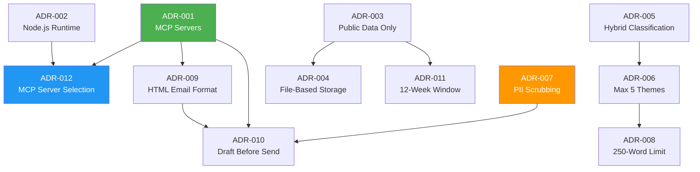
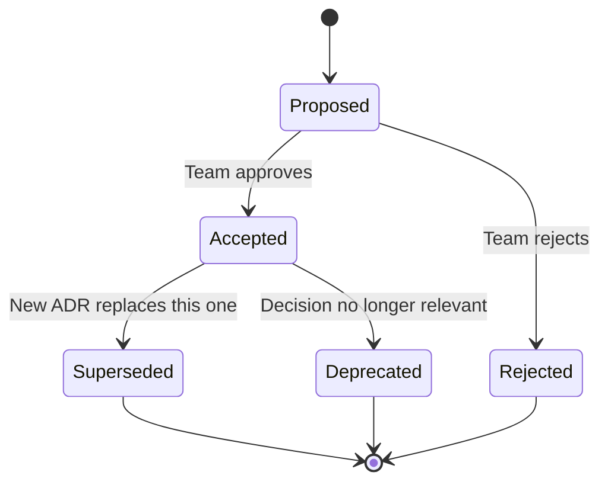

# Decision Log — GrowwPulse

> **Project:** GrowwPulse — Weekly App Review Pulse Generator  
> **Repository:** `c:\growwpulse`  
> **Maintained by:** GrowwPulse Engineering Team  
> **Last Updated:** 2026-05-21

---

## Purpose

This document records all significant technical, architectural, and business decisions made during the GrowwPulse project. It follows the **Architecture Decision Record (ADR)** format to ensure every decision includes full context, the options evaluated, the rationale behind the chosen path, and the downstream consequences.

**Why maintain this log?**

- Provides institutional memory — new team members can understand *why* things are built a certain way
- Prevents re-litigating settled decisions without new information
- Creates an audit trail for compliance and stakeholder reviews
- Surfaces trade-offs explicitly so risks can be monitored over time

---

## Decision Index

| ID | Title | Date | Status | Category |
|:--|:--|:--|:--|:--|
| [ADR-001](#adr-001-use-mcp-servers-instead-of-direct-google-apis) | Use MCP Servers Instead of Direct Google APIs | 2026-05-10 | ✅ Accepted | Architecture |
| [ADR-002](#adr-002-choose-nodejs-as-primary-runtime) | Choose Node.js as Primary Runtime | 2026-05-10 | ✅ Accepted | Technical |
| [ADR-003](#adr-003-public-review-data-only--no-authenticated-scraping) | Public Review Data Only — No Authenticated Scraping | 2026-05-11 | ✅ Accepted | Business / Legal |
| [ADR-004](#adr-004-file-based-storage-over-database) | File-Based Storage Over Database | 2026-05-11 | ✅ Accepted | Architecture |
| [ADR-005](#adr-005-hybrid-theme-classification-keyword--llm) | Hybrid Theme Classification (Keyword + LLM) | 2026-05-12 | ✅ Accepted | Technical |
| [ADR-006](#adr-006-maximum-5-themes-constraint) | Maximum 5 Themes Constraint | 2026-05-12 | ✅ Accepted | Business |
| [ADR-007](#adr-007-pii-scrubbing-at-ingestion-time) | PII Scrubbing at Ingestion Time | 2026-05-13 | ✅ Accepted | Security |
| [ADR-008](#adr-008-250-word-limit-for-pulse-notes) | 250-Word Limit for Pulse Notes | 2026-05-13 | ✅ Accepted | Business |
| [ADR-009](#adr-009-html-email-format-for-gmail-delivery) | HTML Email Format for Gmail Delivery | 2026-05-14 | ✅ Accepted | Technical |
| [ADR-010](#adr-010-email-draft-before-send-two-step-delivery) | Email Draft Before Send (Two-Step Delivery) | 2026-05-14 | ✅ Accepted | Architecture |
| [ADR-011](#adr-011-rolling-12-week-review-window) | Rolling 12-Week Review Window | 2026-05-15 | ✅ Accepted | Business |
| [ADR-012](#adr-012-google-workspace-mcp-server-selection) | Google Workspace MCP Server Selection | 2026-05-15 | ✅ Accepted | Technical |

---

## Decisions

---

### ADR-001: Use MCP Servers Instead of Direct Google APIs

| Field | Detail |
|:--|:--|
| **ID** | ADR-001 |
| **Date** | 2026-05-10 |
| **Status** | ✅ Accepted |
| **Category** | Architecture |
| **Deciders** | GrowwPulse Engineering Team |

**Context:**

GrowwPulse needs to deliver the weekly pulse note as a Gmail draft (and optionally create a Google Doc). This requires integration with Google Workspace APIs — specifically Gmail for email composition and Google Docs/Drive for document creation. The team needed to decide how to integrate with these services: via raw Google API SDKs, through an abstraction layer like MCP servers, or through simpler protocols like SMTP.

**Options Considered:**

| Option | Pros | Cons |
|:--|:--|:--|
| **(A) Direct Google API SDKs** | Full API surface, mature libraries, official support, fine-grained control over every API parameter | Heavy OAuth2 boilerplate (token refresh, consent flows), SDK installation and version management, must handle quota errors and retries, credentials scattered in code |
| **(B) MCP Servers** | Zero API boilerplate — agent calls tools like `gmail_create_draft(to, subject, body)` directly, centralized credential management in MCP config, composable (add Sheets/Calendar later by enabling tools), aligns with AI agent paradigm | Dependency on MCP server availability and maintenance, community-maintained packages may lag behind API changes, additional abstraction layer to debug |
| **(C) SMTP Relay** | Simple, well-understood protocol, no SDK needed, works with any email provider | Cannot create Gmail drafts (send-only), no Google Docs integration, less control over HTML rendering, Gmail may flag as spam if not configured properly |

**Decision:** Use **MCP (Model Context Protocol) servers** for all Google Workspace integrations.

**Rationale:**

MCP servers eliminate the significant boilerplate of direct API integration. Since GrowwPulse is an AI agent pipeline, MCP is the native integration paradigm — the agent can call tools declaratively without managing OAuth tokens, SDK versions, or API error handling. The composability benefit is significant: when stakeholders inevitably request Google Sheets exports or Calendar reminders, the team can enable additional MCP tools without building new integrations. Credential security also improves since OAuth tokens are centralized in the MCP server configuration rather than scattered across environment variables and code.

**Consequences:**

- **Positive:** Dramatically reduced integration code (estimated 200+ lines of OAuth/API boilerplate eliminated), faster development velocity, cleaner architecture, easy extensibility to other Google services
- **Negative:** Runtime dependency on MCP server process availability; if the MCP server crashes, email delivery fails
- **Risks:** Community-maintained MCP packages may have breaking changes or lag behind Google API updates. Mitigated by pinning package versions and maintaining a fallback MCP server option (see [ADR-012](#adr-012-google-workspace-mcp-server-selection))

---

### ADR-002: Choose Node.js as Primary Runtime

| Field | Detail |
|:--|:--|
| **ID** | ADR-002 |
| **Date** | 2026-05-10 |
| **Status** | ✅ Accepted |
| **Category** | Technical |
| **Deciders** | GrowwPulse Engineering Team |

**Context:**

The pipeline requires a runtime that can handle HTTP fetches for review data, JSON/CSV file processing, LLM API calls, and MCP server communication. The team evaluated three options based on ecosystem maturity, MCP SDK support, and developer familiarity.

**Options Considered:**

| Option | Pros | Cons |
|:--|:--|:--|
| **(A) Node.js** | Best MCP ecosystem support (`@modelcontextprotocol/sdk` is first-class), rich npm ecosystem for app store data parsing, excellent async I/O for concurrent fetch operations, large developer community, TypeScript support | Callback/Promise complexity for beginners, single-threaded (not ideal for CPU-heavy tasks, but not relevant here), `node_modules` bloat |
| **(B) Python** | Strong data science ecosystem (pandas, nltk for text processing), readable syntax, good for scripting/automation | MCP SDK support is less mature than Node.js, GIL limits true concurrency, dependency management (venv/pip) adds friction, fewer npm-equivalent packages for app store feeds |
| **(C) Deno** | Modern runtime with built-in TypeScript, secure by default (permissions model), no `node_modules` | Smaller ecosystem, MCP SDK support is experimental, fewer community packages, team would need to learn Deno-specific APIs |

**Decision:** Use **Node.js** (with TypeScript where beneficial) as the primary runtime.

**Rationale:**

The deciding factor was MCP ecosystem maturity. The `@modelcontextprotocol/sdk` package is published on npm and designed for Node.js first. Additionally, npm provides well-maintained packages for fetching App Store RSS feeds and parsing Play Store data. Node.js's event-driven, non-blocking I/O model is ideal for the pipeline's workload pattern: fetching reviews from multiple sources concurrently, processing them, and making API calls to MCP servers.

**Consequences:**

- **Positive:** Access to the most mature MCP toolchain, extensive npm package ecosystem, strong async I/O performance for network-heavy workload, broad community support for troubleshooting
- **Negative:** Team must be comfortable with JavaScript/TypeScript idioms (async/await, Promises), `node_modules` directory can be large
- **Risks:** Node.js LTS version changes may require testing. Mitigated by specifying the Node.js version in `package.json` engines field and using a `.nvmrc` file

---

### ADR-003: Public Review Data Only — No Authenticated Scraping

| Field | Detail |
|:--|:--|
| **ID** | ADR-003 |
| **Date** | 2026-05-11 |
| **Status** | ✅ Accepted |
| **Category** | Business / Legal |
| **Deciders** | GrowwPulse Engineering Team, Project Stakeholders |

**Context:**

The pipeline needs app store review data for the Groww app. Multiple approaches exist for obtaining this data, ranging from official authenticated APIs to public feeds to paid third-party services. The project requirements explicitly state that only public data sources should be used.

**Options Considered:**

| Option | Pros | Cons |
|:--|:--|:--|
| **(A) Official APIs with Authentication** | Complete data access, higher rate limits, structured responses, access to developer replies | Requires Apple App Store Connect and Google Play Console credentials, API key management overhead, potential ToS restrictions on data usage, access limited to app owners |
| **(B) Public RSS/Feeds Only** | No authentication needed, no ToS violation risk, no API key management, anyone can run the pipeline, transparent data sourcing | Limited to publicly available reviews, may not capture all reviews (pagination limits), feed format may change without notice |
| **(C) Paid Third-Party Services** | Rich data, historical archives, analytics dashboards (AppFollow, data.ai, Sensor Tower) | Cost (often $100-500+/month), vendor lock-in, overkill for weekly pulse use case, external dependency for core data |

**Decision:** Use **public feeds and exports only** — specifically Apple RSS review feeds and Google Play public review data via open-source tools or CSV exports.

**Rationale:**

This is a hard constraint from the project requirements. Beyond compliance, it is the right engineering choice for this use case: the pipeline processes reviews weekly, public feeds provide sufficient volume for meaningful analysis, and avoiding authenticated APIs eliminates an entire class of credential management and ToS compliance concerns. Any individual can run the pipeline without needing special access to app store developer accounts.

**Consequences:**

- **Positive:** Zero credential management for data sourcing, no ToS violation risk, pipeline is portable (anyone can run it), simpler architecture
- **Negative:** Limited to reviews available in public feeds (Apple RSS returns ~500 most recent reviews per page), may miss some reviews during high-volume periods
- **Risks:** Apple or Google may change their public feed formats or endpoints. Mitigated by abstracting the ingestion layer behind a consistent interface so feed parsers can be swapped independently

---

### ADR-004: File-Based Storage Over Database

| Field | Detail |
|:--|:--|
| **ID** | ADR-004 |
| **Date** | 2026-05-11 |
| **Status** | ✅ Accepted |
| **Category** | Architecture |
| **Deciders** | GrowwPulse Engineering Team |

**Context:**

The pipeline needs to persist review data (ingested reviews), intermediate processing results (theme classifications), and output artifacts (pulse notes, email HTML). The team evaluated whether a database was justified or if flat file storage would suffice given the workload characteristics: weekly batch processing, single-writer, read-mostly after ingestion, and modest data volumes (~500-2000 reviews per run).

**Options Considered:**

| Option | Pros | Cons |
|:--|:--|:--|
| **(A) SQLite** | SQL query capability, ACID transactions, single-file database, no server to manage, good for structured queries | Requires schema design and migrations, adds dependency, overkill for simple read/write patterns, harder to inspect data manually |
| **(B) MongoDB** | Flexible schema (good for varying review structures), document-oriented (natural fit for JSON review data) | Requires running a MongoDB server or Atlas account, operational overhead, massively overkill for this data volume, adds deployment complexity |
| **(C) JSON/CSV Files** | Human-readable, no dependencies, trivial to inspect and debug, version-controllable, easy to share, works with spreadsheet tools (CSV), native to JavaScript (JSON) | No query optimization, no indexing, no concurrent write safety, entire file must be read into memory for processing |
| **(D) PostgreSQL** | Full relational database, advanced query capabilities, extensions (full-text search), production-grade | Requires server setup and maintenance, connection management, schema migrations, massive overkill for weekly batch workload |

**Decision:** Use **JSON files** for structured data (reviews, classifications, config) and **CSV files** for tabular exports (review datasets).

**Rationale:**

The workload is a weekly batch process with a single writer and modest data volumes. There are no concurrent access requirements, no complex queries, and no need for transactional integrity beyond what atomic file writes provide. JSON files are native to the Node.js runtime and human-readable for debugging. CSV files enable easy sharing with non-technical stakeholders who can open them in Excel or Google Sheets. The simplicity benefit is substantial: zero database setup, zero schema migrations, zero connection pooling, zero operational overhead.

**Consequences:**

- **Positive:** Zero infrastructure dependencies, human-readable data files, easy debugging (open in any text editor), files can be version-controlled, CSV files openable in spreadsheet tools
- **Negative:** No query optimization (must scan full files), no concurrent write safety, file size grows linearly (but bounded by rolling window — see [ADR-011](#adr-011-rolling-12-week-review-window))
- **Risks:** If the project scales to multi-product or real-time processing, file-based storage will become a bottleneck. Mitigated by defining a clean data access layer that could be swapped to SQLite if needed in the future

---

### ADR-005: Hybrid Theme Classification (Keyword + LLM)

| Field | Detail |
|:--|:--|
| **ID** | ADR-005 |
| **Date** | 2026-05-12 |
| **Status** | ✅ Accepted |
| **Category** | Technical |
| **Deciders** | GrowwPulse Engineering Team |

**Context:**

The pipeline must classify each ingested review into one of up to 5 themes (see [ADR-006](#adr-006-maximum-5-themes-constraint)). The classification needs to be accurate enough to produce meaningful weekly pulse notes but does not require research-grade NLP. The team evaluated approaches ranging from simple keyword matching to full ML model training.

**Options Considered:**

| Option | Pros | Cons |
|:--|:--|:--|
| **(A) Pure Keyword/Regex** | Deterministic, fast, no external dependencies, easy to debug and audit, zero cost | Misses nuance and context (e.g., "the app crashed my portfolio view" vs. "crashed the market"), high false-positive rate for ambiguous terms, requires extensive keyword list maintenance |
| **(B) Trained ML Model** | High accuracy once trained, handles nuance well, can learn domain-specific patterns | Requires labeled training data (expensive to create), model training infrastructure, ongoing retraining as language evolves, cold-start problem for new themes |
| **(C) LLM-Only Classification** | Excellent contextual understanding, handles sarcasm/nuance, zero training data needed, can dynamically discover themes | LLM API cost per classification, latency per API call, potential for inconsistent classifications across runs, dependency on external LLM service availability |
| **(D) Hybrid Keyword + LLM** | Keywords provide fast, deterministic baseline for clear-cut reviews; LLM handles ambiguous/nuanced cases; no training data needed; graceful degradation if LLM is unavailable | More complex implementation (two classification paths), must define threshold for "ambiguous" reviews, LLM cost for subset of reviews |

**Decision:** Use a **hybrid approach** — keyword-based classification as the primary layer with LLM-assisted classification for ambiguous or low-confidence reviews.

**Rationale:**

Many Groww reviews contain explicit signals that map cleanly to themes via keywords (e.g., "crash," "freeze," "KYC," "support ticket"). A keyword layer handles these cheaply and deterministically. However, reviews like *"I tried to sell my mutual fund but the money never came back and nobody helped me"* span multiple themes and require contextual understanding that only an LLM provides. The hybrid approach optimizes for cost (most reviews classified via free keyword matching) while preserving quality (LLM handles the hard cases). It also provides graceful degradation: if the LLM is unavailable, the keyword layer still produces a usable classification.

**Consequences:**

- **Positive:** Cost-efficient (LLM called only for ~20-30% of reviews), deterministic baseline ensures consistency, graceful degradation without LLM, no training data required
- **Negative:** Two classification code paths to maintain, must calibrate the "confidence threshold" that triggers LLM escalation
- **Risks:** LLM classifications may vary between runs for the same review (non-deterministic). Mitigated by using low-temperature settings and caching LLM responses for previously seen review text

---

### ADR-006: Maximum 5 Themes Constraint

| Field | Detail |
|:--|:--|
| **ID** | ADR-006 |
| **Date** | 2026-05-12 |
| **Status** | ✅ Accepted |
| **Category** | Business |
| **Deciders** | Project Stakeholders, GrowwPulse Engineering Team |

**Context:**

The theme classification system needs a defined upper bound on the number of theme categories. Too many themes dilute the signal and make the pulse note harder to scan. Too few themes force unnatural groupings. The project requirements specify a maximum of 5, but the team needed to evaluate whether this was the right number and how to handle edge cases.

**Options Considered:**

| Option | Pros | Cons |
|:--|:--|:--|
| **(A) Dynamic / Unlimited** | Captures all nuances, no reviews forced into ill-fitting buckets, adapts to changing review landscape | Pulse note becomes unwieldy, harder to track trends week-over-week, no consistent theme taxonomy, cognitive overload for readers |
| **(B) Fixed 5 Themes** | Matches requirement constraint, scannable pulse note, forces meaningful high-level grouping, consistent taxonomy week-over-week | Some reviews may not fit neatly, may lose granularity on niche issues, requires a catch-all strategy |
| **(C) Configurable 3–7** | Flexible, adaptable to different reporting needs, team can tune over time | Configuration drift, harder to compare pulses across weeks if theme count changes, adds decision overhead each week |

**Decision:** Use a **fixed maximum of 5 themes** as specified in the project requirements.

**Rationale:**

The 5-theme cap is a product requirement driven by the goal of keeping the pulse note scannable in under 2 minutes. Five themes provide enough granularity to capture distinct user pain points (App Stability, Customer Support, UX, Transactions, Onboarding) while remaining cognitively manageable. The pulse note only highlights the top 3, so 5 themes provide a buffer for the remaining 2 to capture secondary signals. Reviews that don't fit the top 5 themes are bucketed into an implicit "Other" category — tracked internally but not surfaced in the pulse unless they cross a volume threshold.

**Consequences:**

- **Positive:** Consistent pulse format week-over-week, scannable output, forces the system to prioritize the most impactful themes, aligns with requirement constraints
- **Negative:** Niche issues (e.g., "dark mode requests") may be absorbed into broader themes or dropped into "Other," potentially masking early signals
- **Risks:** If user sentiment shifts dramatically (e.g., a major outage creates a new dominant theme), the fixed taxonomy may lag. Mitigated by allowing the theme classification layer to dynamically derive theme *names* from review data each week (not hardcoded labels) while respecting the count cap

---

### ADR-007: PII Scrubbing at Ingestion Time

| Field | Detail |
|:--|:--|
| **ID** | ADR-007 |
| **Date** | 2026-05-13 |
| **Status** | ✅ Accepted |
| **Category** | Security |
| **Deciders** | GrowwPulse Engineering Team |

**Context:**

App store reviews occasionally contain personally identifiable information (PII) — email addresses, phone numbers, names, account numbers, UPI IDs, or other identifiers. The project has a strict no-PII policy: no PII should appear in stored data, generated pulse notes, or emails. The team needed to decide when in the pipeline to perform PII scrubbing to minimize risk.

**Options Considered:**

| Option | Pros | Cons |
|:--|:--|:--|
| **(A) Scrub at Ingestion** | PII never persisted to disk, reduces risk surface from the earliest point, easier to audit stored data, defense-in-depth starting position | May over-scrub (false positives remove legitimate text), cannot recover original text if scrubbing was too aggressive |
| **(B) Scrub at Output Generation** | Original data preserved for analysis, can refine scrubbing logic without re-ingesting, more accurate context-aware scrubbing | PII exists in stored files (risk if files are shared or leaked), longer risk exposure window, must remember to scrub at every output point |
| **(C) Scrub at Both Stages** | Maximum safety — defense in depth, catches anything missed by either stage | Most complex implementation, double processing cost, potential for double-scrubbing artifacts (e.g., `[REDACTED]` being flagged again) |

**Decision:** **Scrub at ingestion** as the primary defense, with a secondary verification pass at output generation (defense in depth).

**Rationale:**

The principle of "don't store what you don't need" drives this decision. By scrubbing PII at ingestion, the pipeline ensures that stored JSON/CSV files never contain sensitive data — even if these files are accidentally shared, committed to version control, or accessed by unauthorized parties. The secondary verification at output generation catches any PII that the ingestion scrubber missed (e.g., PII in unusual formats). This defense-in-depth approach is standard practice for handling sensitive data in pipelines.

**PII Patterns Scrubbed:**

| PII Type | Detection Method | Replacement |
|:--|:--|:--|
| Email addresses | Regex: `\b[\w.+-]+@[\w-]+\.[\w.]+\b` | `[EMAIL_REDACTED]` |
| Phone numbers | Regex: `\b(\+?\d{1,3}[-.\s]?)?\(?\d{3}\)?[-.\s]?\d{3}[-.\s]?\d{4}\b` | `[PHONE_REDACTED]` |
| Names (usernames) | Review metadata field stripping | Field omitted entirely |
| Account/UPI IDs | Regex: `\b[\w.]+@[\w]+\b` (UPI), pattern matching for account numbers | `[ID_REDACTED]` |

**Consequences:**

- **Positive:** PII never touches persistent storage, reduced liability, easier compliance auditing, defense-in-depth architecture
- **Negative:** Potential false positives (e.g., a review mentioning "email support@groww.in" gets the email redacted even though it's a public support address), original text unrecoverable after scrubbing
- **Risks:** Novel PII formats not covered by regex patterns. Mitigated by periodic review of scrubbed data to identify missed patterns and update regex rules

---

### ADR-008: 250-Word Limit for Pulse Notes

| Field | Detail |
|:--|:--|
| **ID** | ADR-008 |
| **Date** | 2026-05-13 |
| **Status** | ✅ Accepted |
| **Category** | Business |
| **Deciders** | Project Stakeholders |

**Context:**

The weekly pulse note is the primary output artifact. Its length directly affects readability, engagement, and actionability. Too short and it lacks useful detail; too long and busy stakeholders won't read it. The team needed to set a word limit that balances informativeness with scannability.

**Options Considered:**

| Option | Pros | Cons |
|:--|:--|:--|
| **(A) No Limit** | Maximum flexibility, can include all relevant detail, no information loss | Stakeholders won't read long reports, buries key insights in walls of text, inconsistent length week-over-week |
| **(B) 150 Words** | Ultra-scannable, fits in a phone screen, forces extreme brevity | Too short to include 3 themes + 3 quotes + 3 actions with any context, may feel incomplete |
| **(C) 250 Words** | Fits on one page/screen, scannable in <2 minutes, enough room for 3 themes + 3 quotes + 3 actions with context, executive-friendly | Must be concise — every word matters, may need to drop detail from lower-priority themes |
| **(D) 500 Words** | Room for detailed analysis, can include 5 themes with context, space for caveats and methodology notes | Too long for a weekly "pulse" — becomes a report, lower engagement rate, exceeds one screen on most devices |

**Decision:** **250 words maximum** as specified in the project requirements.

**Rationale:**

The 250-word limit is calibrated for the target audience: product managers, support leads, and executives who receive dozens of updates daily. Research on internal communication effectiveness suggests that sub-300-word updates achieve 2-3x higher read-through rates than longer formats. At 250 words, the pulse note fits comfortably on one screen (desktop or mobile), can be read in under 2 minutes, and forces the system to surface only the most impactful insights. The structured format (3 themes + 3 quotes + 3 actions) provides a consistent skeleton that stakeholders learn to scan efficiently.

**Word Budget Allocation:**

| Section | Approx. Words | Purpose |
|:--|:--|:--|
| Header + metadata | ~20 | Week range, review count |
| Top 3 Themes | ~60 | Theme names, mention counts, avg ratings |
| User Voices (3 quotes) | ~90 | Real anonymized quotes with ratings |
| Action Ideas (3 items) | ~60 | Specific, actionable recommendations |
| Footer | ~20 | Data sources, review period |
| **Total** | **~250** | |

**Consequences:**

- **Positive:** High read-through rate, consistent format, forces prioritization of most impactful insights, fits one screen, mobile-friendly
- **Negative:** Lower-priority themes and nuances must be omitted, some weeks may have more than 3 important themes that can't all be highlighted
- **Risks:** Critical emerging issue in position 4-5 may be missed by readers who only scan the pulse. Mitigated by including a "Notable Mentions" one-liner if a non-top-3 theme crosses a severity threshold

---

### ADR-009: HTML Email Format for Gmail Delivery

| Field | Detail |
|:--|:--|
| **ID** | ADR-009 |
| **Date** | 2026-05-14 |
| **Status** | ✅ Accepted |
| **Category** | Technical |
| **Deciders** | GrowwPulse Engineering Team |

**Context:**

The weekly pulse note is delivered as a Gmail draft/email. The team needed to decide the email body format. The choice affects visual presentation, cross-client compatibility, and implementation complexity.

**Options Considered:**

| Option | Pros | Cons |
|:--|:--|:--|
| **(A) Plain Text** | Universal compatibility, simple to generate, no rendering issues, small email size | No formatting (bold, colors, dividers), looks unprofessional, harder to scan (no visual hierarchy), can't embed the structured layout from the spec |
| **(B) HTML with Inline CSS** | Professional appearance, supports bold/colors/dividers for visual hierarchy, inline CSS works across all major email clients (Gmail, Outlook, Apple Mail), matches the structured pulse format | Must use inline CSS (not `<style>` blocks — many clients strip them), slightly more complex generation, must test rendering across clients |
| **(C) Rich Text / MIME Multipart** | Can include both plain text and HTML alternatives, supports attachments | Overly complex for this use case, more bytes per email, MIME handling adds implementation burden |

**Decision:** Use **HTML with inline CSS** for the email body.

**Rationale:**

The pulse note's structured format (headers, dividers, bold theme names, quoted text, emoji icons) requires visual formatting to be scannable. Plain text cannot reproduce this visual hierarchy. HTML with inline CSS is the industry standard for formatted emails and is supported by all major email clients. The key constraint is using inline CSS rather than `<style>` blocks or external stylesheets, since many email clients (notably Gmail's web interface) strip `<style>` tags. The MCP server's `gmail_create_draft` tool accepts HTML bodies natively, so no additional conversion is needed.

**HTML Template Approach:**

```html
<!-- Example structure (simplified) -->
<div style="font-family: Arial, sans-serif; max-width: 600px; margin: 0 auto;">
  <h2 style="color: #1a73e8;">📊 GrowwPulse — Weekly Review Digest</h2>
  <p style="color: #666;">Week of May 12–18, 2026</p>
  <hr style="border: 1px solid #e0e0e0;">
  <h3>🔥 Top Themes This Week</h3>
  <!-- Theme items with inline styles -->
  <hr style="border: 1px solid #e0e0e0;">
  <h3>💬 User Voices</h3>
  <!-- Blockquotes with inline styles -->
  <hr style="border: 1px solid #e0e0e0;">
  <h3>💡 Action Ideas</h3>
  <!-- Numbered list with inline styles -->
</div>
```

**Consequences:**

- **Positive:** Professional, scannable email output, visual hierarchy matches the pulse note spec, works across all major email clients, MCP server accepts HTML natively
- **Negative:** HTML generation is more complex than plain text, inline CSS is verbose, must test across email clients to ensure consistent rendering
- **Risks:** Some corporate email clients or security tools may strip HTML or render it inconsistently. Mitigated by using conservative inline CSS (standard fonts, simple colors, no complex layouts) and testing in Gmail, Outlook, and Apple Mail

---

### ADR-010: Email Draft Before Send (Two-Step Delivery)

| Field | Detail |
|:--|:--|
| **ID** | ADR-010 |
| **Date** | 2026-05-14 |
| **Status** | ✅ Accepted |
| **Category** | Architecture |
| **Deciders** | GrowwPulse Engineering Team |

**Context:**

The pipeline generates a pulse note and delivers it via Gmail. The team needed to decide whether the system should auto-send the email immediately or create a draft first for human review. This decision balances automation efficiency against safety and quality control.

**Options Considered:**

| Option | Pros | Cons |
|:--|:--|:--|
| **(A) Auto-Send Immediately** | Fully automated, zero human intervention needed, fastest delivery | No safety net — bad data, hallucinated quotes, or PII leaks go directly to recipients, cannot retract after send, risky for a v1 system |
| **(B) Create Draft Only** | Human reviews before sending, safety net for bad data or formatting issues, can edit the draft before sending | Requires manual step each week (open Gmail, review draft, click send), delays delivery |
| **(C) Draft Then User Confirms** | Best of both worlds — draft is created, user gets a notification, confirms via config flag or manual action | Most complex implementation, requires notification mechanism, still needs human in the loop |

**Decision:** **Create a draft first** as the default behavior, with an optional auto-send mode configurable via the pipeline's config file.

**Rationale:**

For a v1 system generating AI-derived content, the safe default is human-in-the-loop review. LLM-generated pulse notes may occasionally contain hallucinated quotes, incorrectly classified themes, or PII that slipped past the scrubbing layer. A draft-first approach lets the operator review the email before it reaches stakeholders, preventing embarrassing or harmful errors. Once the team gains confidence in the pipeline's output quality (after several weeks of successful runs), they can flip the config to auto-send mode.

**Config Example:**

```json
{
  "delivery": {
    "mode": "draft",
    "auto_send": false,
    "recipients": ["team-alias@company.com"],
    "cc": []
  }
}
```

**Consequences:**

- **Positive:** Safety net prevents bad data from reaching stakeholders, allows human review and editing, builds trust in the system gradually, easy to switch to auto-send when ready
- **Negative:** Requires a manual step each week (opening Gmail and sending the draft), delays delivery by the time it takes the operator to review
- **Risks:** Operator forgets to send the draft, causing the pulse to be skipped that week. Mitigated by the optional auto-send config and by potentially adding a reminder notification in a future iteration

---

### ADR-011: Rolling 12-Week Review Window

| Field | Detail |
|:--|:--|
| **ID** | ADR-011 |
| **Date** | 2026-05-15 |
| **Status** | ✅ Accepted |
| **Category** | Business |
| **Deciders** | Project Stakeholders, GrowwPulse Engineering Team |

**Context:**

The pipeline needs a defined time window for which reviews to include in each weekly analysis. Too narrow a window may miss important trends; too wide a window drowns the signal in stale data. The project requirements specify an 8-12 week window, and the team needed to formalize this as a rolling window policy.

**Options Considered:**

| Option | Pros | Cons |
|:--|:--|:--|
| **(A) Last 1 Week** | Hyper-current, no stale data, very responsive to recent changes | Sample size too small (may have <50 reviews), theme classification unreliable with small samples, one bad week distorts the entire picture |
| **(B) Last 4 Weeks** | Reasonable recency, moderate sample size, captures short-term trends | May miss slower-building trends, 4-week patterns may not align with product release cycles |
| **(C) Last 8–12 Weeks (Rolling)** | Captures trends over a quarter, aligns with product planning cycles, robust sample sizes (500-2000+ reviews), smooths out weekly noise | Includes some reviews that may be stale (addressed issues from 3 months ago), larger data volume to process |
| **(D) All Time** | Maximum data, can identify long-term trends, largest sample size | Overwhelmed by stale data, old issues dominate themes even if they've been fixed, increasingly large data volume over time, processing cost grows unbounded |

**Decision:** Use a **rolling 8-12 week window**, defaulting to **12 weeks** with a configurable parameter.

**Rationale:**

The 8-12 week window is a project requirement that aligns well with quarterly product planning cycles. A 12-week window provides sufficient sample size for reliable theme classification (typically 500-2000+ reviews for a popular app like Groww) while ensuring that data older than one quarter naturally ages out. The rolling nature means each week's pulse reflects the most recent 12 weeks, automatically dropping the oldest week's data — no manual cleanup required.

**Implementation Detail:**

```javascript
// Date filter applied at ingestion time
const WINDOW_WEEKS = config.reviewWindowWeeks || 12;
const cutoffDate = new Date();
cutoffDate.setDate(cutoffDate.getDate() - (WINDOW_WEEKS * 7));

const filteredReviews = reviews.filter(r => new Date(r.date) >= cutoffDate);
```

**Consequences:**

- **Positive:** Robust sample sizes for reliable classification, aligns with quarterly planning, stale data ages out automatically, configurable window for flexibility
- **Negative:** Some reviews in the window may reference issues already fixed, requires correct date parsing across both app stores (different date formats)
- **Risks:** If Groww releases a major update mid-window, older reviews may be about a significantly different version of the app. Mitigated by weighting more recent reviews higher in theme scoring and noting the app version if available in review data

---

### ADR-012: Google Workspace MCP Server Selection

| Field | Detail |
|:--|:--|
| **ID** | ADR-012 |
| **Date** | 2026-05-15 |
| **Status** | ✅ Accepted |
| **Category** | Technical |
| **Deciders** | GrowwPulse Engineering Team |

**Context:**

Having decided to use MCP servers for Google Workspace integration ([ADR-001](#adr-001-use-mcp-servers-instead-of-direct-google-apis)), the team needed to select which specific MCP server package to use. Multiple community-maintained options exist, each with different service coverage, maintenance activity, and installation methods.

**Options Considered:**

| Option | Pros | Cons |
|:--|:--|:--|
| **(A) `@alanxchen/google-workspace-mcp`** | Broadest service coverage (Gmail, Docs, Drive, Calendar, Sheets), published on npm for easy installation, active maintenance, well-documented | Community-maintained (not official Google), may have breaking changes, single maintainer risk |
| **(B) `j3k0/mcp-google-workspace`** | Focused on Gmail and Calendar, battle-tested for email workflows, GitHub-based installation | Narrower service coverage (no Docs/Drive), requires `git clone` instead of `npm install`, less convenient for CI/CD |
| **(C) `bobmatnyc/gworkspace-mcp`** | Covers Gmail, Docs, Drive, and Tasks, active development | Newer project (less battle-tested), smaller community, API surface may change frequently |
| **(D) Google Official Remote MCP** | Official Google support, full Workspace suite, long-term maintenance guaranteed | May not yet be available or in limited preview, likely requires Google Cloud project with billing, more complex setup |

**Decision:** Use **`@alanxchen/google-workspace-mcp`** as the primary MCP server, with **`j3k0/mcp-google-workspace`** as a fallback for Gmail-only operations.

**Rationale:**

`@alanxchen/google-workspace-mcp` provides the broadest service coverage needed by GrowwPulse — Gmail for email delivery, Google Docs for optional document creation, and Google Drive for document management. Being published on npm makes installation straightforward (`npm install -g @alanxchen/google-workspace-mcp`) and compatible with the Node.js toolchain (see [ADR-002](#adr-002-choose-nodejs-as-primary-runtime)). The fallback to `j3k0/mcp-google-workspace` provides resilience: if the primary package has a breaking change, the team can switch to the fallback for Gmail-only operations (the critical path) while the primary is resolved.

**MCP Server Comparison Matrix:**

| Feature | @alanxchen | j3k0 | bobmatnyc | Google Official |
|:--|:--|:--|:--|:--|
| Gmail (Send/Draft) | ✅ | ✅ | ✅ | ✅ |
| Google Docs | ✅ | ❌ | ✅ | ✅ |
| Google Drive | ✅ | ❌ | ✅ | ✅ |
| Google Calendar | ✅ | ✅ | ❌ | ✅ |
| Google Sheets | ✅ | ❌ | ❌ | ✅ |
| npm Package | ✅ | ❌ | ❌ | TBD |
| Active Maintenance | ✅ | ✅ | ✅ | ✅ |
| **Selected** | **Primary** | **Fallback** | — | — |

**Version Pinning Strategy:**

```json
// package.json — pin exact versions to prevent breaking changes
{
  "dependencies": {
    "@alanxchen/google-workspace-mcp": "1.2.3"
  }
}
```

**Consequences:**

- **Positive:** Broadest service coverage from a single package, npm installation aligns with Node.js toolchain, fallback option provides resilience, version pinning prevents surprise breakages
- **Negative:** Dependency on community-maintained packages (no SLA), primary package has single maintainer risk
- **Risks:** Package may be abandoned or have a security vulnerability. Mitigated by version pinning, maintaining the fallback option, monitoring the package's GitHub repository for activity, and being prepared to fork if necessary

---

## Decision Relationship Map

The following diagram shows how decisions relate to and depend on each other:



---

## Glossary

| Term | Definition |
|:--|:--|
| **ADR** | Architecture Decision Record — a document that captures an important architectural decision along with its context and consequences |
| **MCP** | Model Context Protocol — an open standard providing a universal interface for AI agents to connect to external tools and data sources |
| **PII** | Personally Identifiable Information — any data that could be used to identify a specific individual (e.g., email, phone number, name) |
| **OAuth** | Open Authorization — an open standard for access delegation, used by Google APIs for authentication and authorization |
| **OAuth2** | Version 2.0 of the OAuth protocol, the standard used by Google Workspace APIs |
| **RSS** | Really Simple Syndication — a web feed format used to publish frequently updated content (e.g., Apple App Store review feeds) |
| **LLM** | Large Language Model — an AI model trained on large text datasets, used here for nuanced review classification |
| **ToS** | Terms of Service — legal agreements governing the use of a service (e.g., App Store review data usage policies) |
| **SMTP** | Simple Mail Transfer Protocol — the standard protocol for sending emails |
| **MIME** | Multipurpose Internet Mail Extensions — a standard for formatting non-ASCII messages (attachments, HTML emails) |
| **SDK** | Software Development Kit — a set of tools and libraries for building applications on a specific platform |
| **CI/CD** | Continuous Integration / Continuous Deployment — automated software build, test, and deployment pipelines |
| **ACID** | Atomicity, Consistency, Isolation, Durability — properties guaranteeing reliable database transactions |
| **UPI** | Unified Payments Interface — India's real-time payment system, IDs appear as `username@bankname` |
| **NRI** | Non-Resident Indian — relevant to Groww's onboarding flows for international users |
| **GIL** | Global Interpreter Lock — a Python mechanism that limits true multithreaded execution |
| **KYC** | Know Your Customer — identity verification processes required by financial services |
| **F&O** | Futures and Options — financial derivatives traded on stock exchanges |

---

## Guidelines for Adding New Decisions

When a new significant decision needs to be recorded, follow this process:

### 1. When to Write an ADR

Create a new ADR when:

- Choosing between multiple viable technical approaches
- Making a decision that affects the system's architecture or data flow
- Adopting or rejecting a third-party dependency
- Changing a security or privacy policy
- Responding to a production incident that requires an architectural change
- Superseding a previous decision

### 2. ADR Template

Copy this template for new decisions:

```markdown
### ADR-XXX: [Title]

| Field | Detail |
|:--|:--|
| **ID** | ADR-XXX |
| **Date** | YYYY-MM-DD |
| **Status** | Proposed / Accepted / Superseded / Deprecated |
| **Category** | Technical / Business / Architecture / Security |
| **Deciders** | [Team/Role names] |

**Context:** [Why this decision was needed — what problem or question triggered it]

**Options Considered:**

| Option | Pros | Cons |
|:--|:--|:--|
| (A) ... | ... | ... |
| (B) ... | ... | ... |

**Decision:** [What was decided and which option was chosen]

**Rationale:** [Why this option was chosen over the alternatives]

**Consequences:**
- **Positive:** ...
- **Negative:** ...
- **Risks:** ...

---
```

### 3. Status Lifecycle



| Status | Meaning |
|:--|:--|
| **Proposed** | Decision is under discussion, not yet finalized |
| **Accepted** | Decision has been approved and is in effect |
| **Superseded** | A newer decision (referenced by ID) replaces this one |
| **Deprecated** | Decision is no longer relevant due to scope or requirement changes |
| **Rejected** | Decision was proposed but not approved |

### 4. Numbering Convention

- Use sequential numbering: `ADR-001`, `ADR-002`, ..., `ADR-013`, etc.
- Never reuse a retired ADR number
- When superseding, add a note to the old ADR: `Superseded by ADR-XXX`

### 5. Review Process

1. Draft the ADR using the template above
2. Add it to this document with status **Proposed**
3. Present to the team for discussion
4. Update status to **Accepted** (or **Rejected**) after team consensus
5. Update the **Decision Index** table at the top of this document

---

## Revision History

| Version | Date | Author | Changes |
|:--|:--|:--|:--|
| 1.0 | 2026-05-10 | GrowwPulse Team | Initial decision log created with ADR-001 through ADR-004 |
| 1.1 | 2026-05-12 | GrowwPulse Team | Added ADR-005 (Hybrid Classification) and ADR-006 (5 Themes Constraint) |
| 1.2 | 2026-05-13 | GrowwPulse Team | Added ADR-007 (PII Scrubbing) and ADR-008 (250-Word Limit) |
| 1.3 | 2026-05-14 | GrowwPulse Team | Added ADR-009 (HTML Email) and ADR-010 (Draft Before Send) |
| 1.4 | 2026-05-15 | GrowwPulse Team | Added ADR-011 (12-Week Window) and ADR-012 (MCP Server Selection) |
| 1.5 | 2026-05-21 | GrowwPulse Team | Added decision relationship map, glossary, and contribution guidelines |

---

> **Document Owner:** GrowwPulse Engineering Team  
> **Review Cadence:** Update whenever a new significant decision is made  
> **Related Documents:** [Problem Statement](file:///c:/growwpulse/Docs/Problem.Statment.md)
