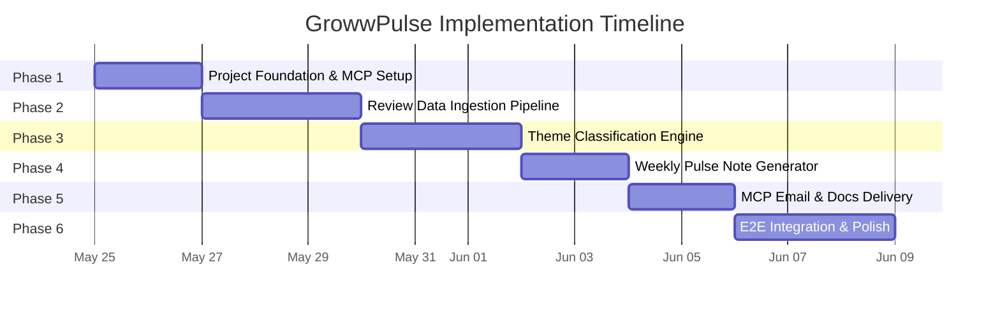
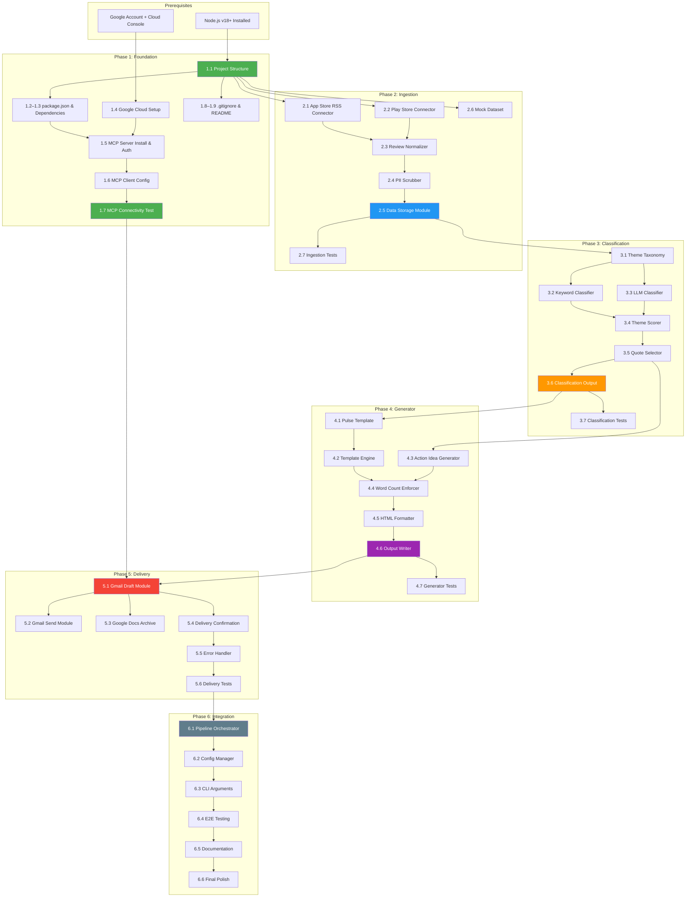
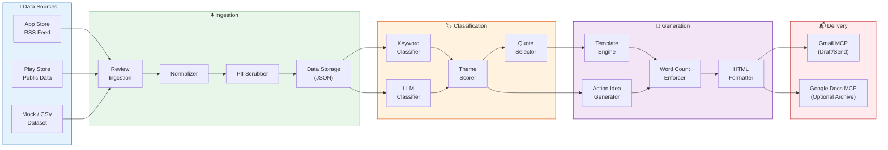
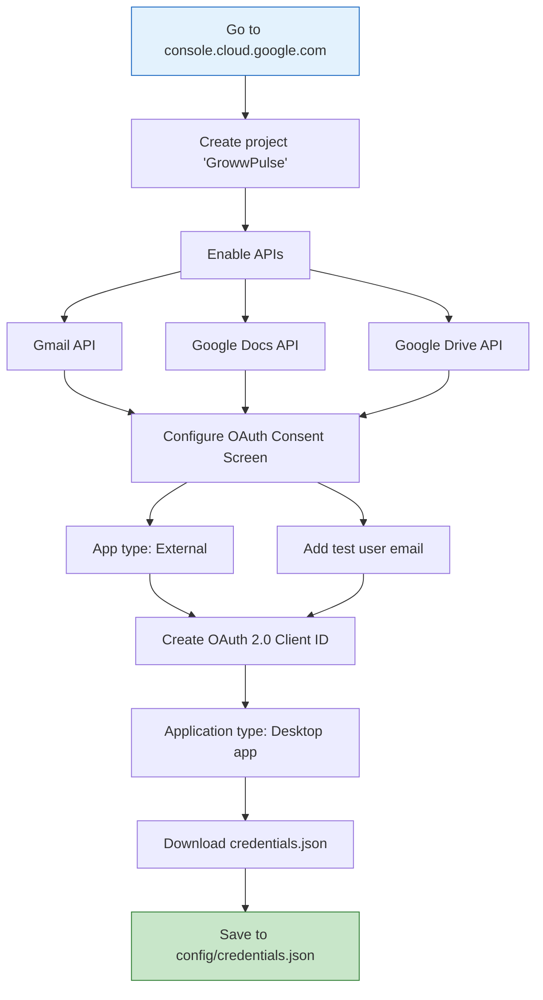
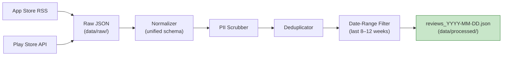
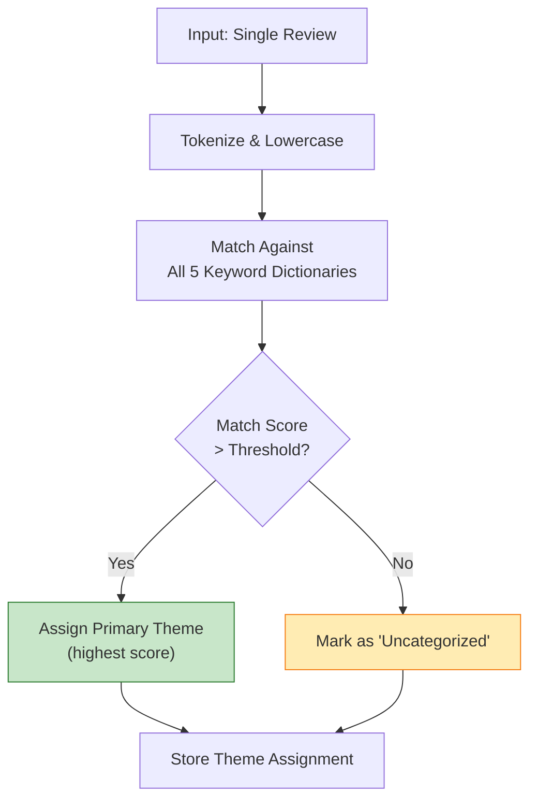
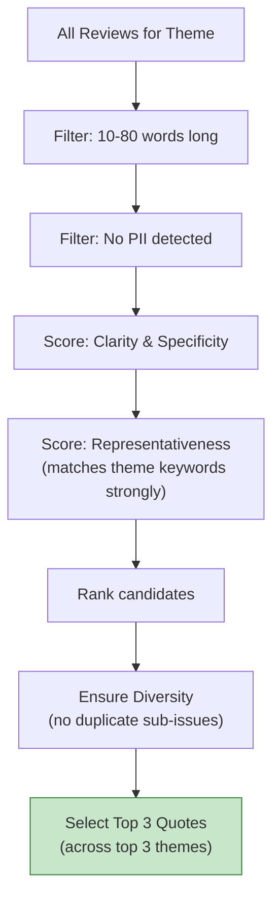
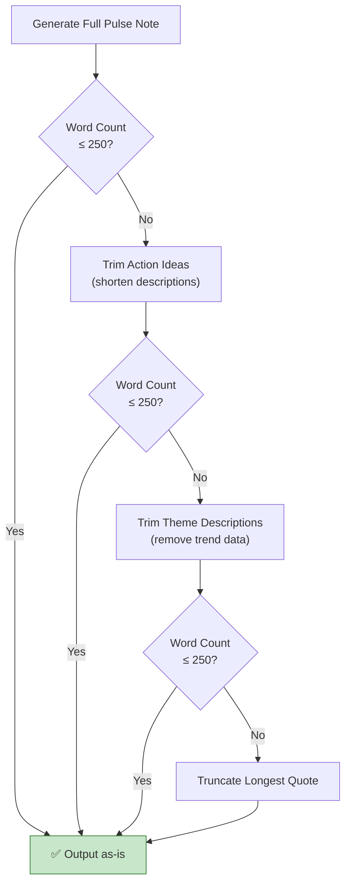
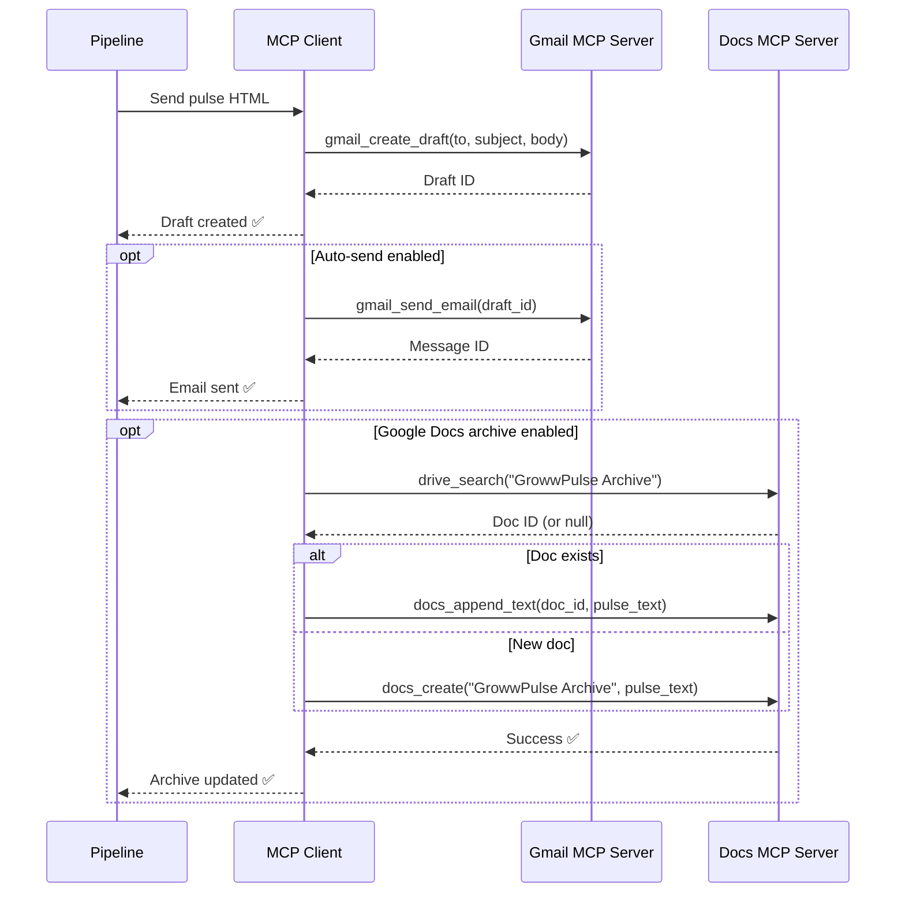
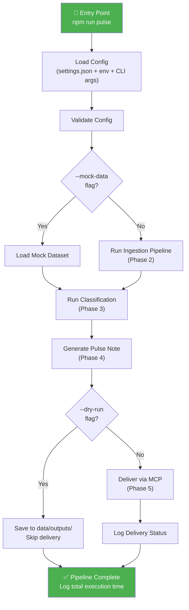

# 📋 GrowwPulse — Implementation Plan

> **Project:** GrowwPulse — Weekly App Review Pulse Generator
> **Version:** 1.0
> **Created:** 2026-05-21
> **Status:** 🟡 Planning
> **Total Estimated Duration:** 15 working days (3 weeks)

---

## Executive Summary

GrowwPulse is an automated AI agent pipeline that ingests public App Store and Play Store reviews for the [Groww](https://groww.in) investment app, classifies them into actionable themes, generates a concise ≤250-word weekly pulse note, and delivers it as a Gmail draft/email via MCP (Model Context Protocol) servers. This document details the phased implementation plan across **6 phases** spanning **15 working days**.

---

## 📅 Summary Timeline

| Phase | Name | Days | Calendar | Key Deliverable | Status |
|:-----:|:-----|:----:|:---------|:-----------------|:------:|
| **1** | Project Foundation & MCP Server Setup | 1–2 | Week 1 (Mon–Tue) | MCP servers connected & verified | ⬜ Not Started |
| **2** | Review Data Ingestion Pipeline | 3–5 | Week 1–2 (Wed–Fri) | Normalized, PII-scrubbed review dataset | ⬜ Not Started |
| **3** | Theme Classification Engine | 6–8 | Week 2 (Mon–Wed) | Hybrid classifier with scored themes | ⬜ Not Started |
| **4** | Weekly Pulse Note Generator | 9–10 | Week 2 (Thu–Fri) | ≤250-word pulse in MD + HTML | ⬜ Not Started |
| **5** | MCP Email & Docs Delivery | 11–12 | Week 3 (Mon–Tue) | Gmail draft delivered via MCP | ⬜ Not Started |
| **6** | End-to-End Integration & Polish | 13–15 | Week 3 (Wed–Fri) | Complete runnable pipeline with CLI | ⬜ Not Started |



---

## 🔗 Dependency Graph



---

## 🏗️ Pipeline Architecture



---

## 🛠️ Technology Choices

| Category | Technology | Rationale |
|:---------|:-----------|:----------|
| **Runtime** | Node.js v18+ | Native JSON handling, rich npm ecosystem, MCP SDK support |
| **Package Manager** | npm | Default for Node.js, lockfile support |
| **App Store Ingestion** | Apple RSS Feed (native `fetch`) | Public, no-auth, JSON format, Apple-supported |
| **Play Store Ingestion** | `google-play-scraper` npm | Most popular open-source package, public data only |
| **PII Detection** | Custom regex + heuristics | Lightweight, no external dependencies, sufficient for emails/phones/IDs |
| **Theme Classification** | Hybrid: keyword dictionaries + LLM | Keywords for speed & reliability; LLM for nuance & accuracy |
| **Template Engine** | Custom string interpolation | Simple requirement, no need for Handlebars/EJS overhead |
| **HTML Email** | Inline CSS templates | Email client compatibility, no external CSS support |
| **Email Delivery** | MCP `gmail_create_draft` / `gmail_send_email` | Zero API boilerplate, secure credential management |
| **Docs Archive** | MCP `docs_create` / `docs_append_text` | Optional, same MCP infrastructure |
| **MCP Server** | `@alanxchen/google-workspace-mcp` | Unified Gmail + Docs + Drive, community maintained |
| **Testing** | Node.js built-in test runner or Jest | Lightweight, zero-config for unit tests |
| **Config Format** | JSON (`config/settings.json`) | Native to Node.js, easy to parse and validate |
| **Version Control** | Git + `.gitignore` | Standard, credentials excluded |

---

## Phase 1: Project Foundation & MCP Server Setup

> **Timeline:** Days 1–2 · **Effort:** 1–2 days

### Objectives

- Initialize project structure and dependencies
- Set up Google Cloud project with OAuth credentials
- Configure and test MCP servers for Gmail and Google Docs
- Verify MCP connectivity end-to-end

### Task Breakdown

| ID | Task | Priority | Effort | Notes |
|:---|:-----|:--------:|:------:|:------|
| 1.1 | Create project directory structure | 🔴 High | 0.5h | See directory tree below |
| 1.2 | Initialize Node.js project (`package.json`) | 🔴 High | 0.25h | `npm init -y` with project metadata |
| 1.3 | Install core dependencies | 🔴 High | 0.5h | MCP SDK, google-play-scraper, etc. |
| 1.4 | Google Cloud project setup | 🔴 High | 1–2h | Enable APIs, OAuth consent, credentials |
| 1.5 | Install & configure MCP server | 🔴 High | 1h | OAuth flow, refresh token saved |
| 1.6 | Configure MCP client settings | 🔴 High | 0.5h | `settings.json` or equivalent |
| 1.7 | Test MCP connectivity | 🔴 High | 0.5h | Test draft email + test Google Doc |
| 1.8 | Create `.gitignore` | 🟡 Med | 0.25h | Exclude `credentials.json`, tokens, `node_modules` |
| 1.9 | Create `README.md` with setup instructions | 🟡 Med | 0.5h | Quick-start guide |

### 1.1 — Directory Structure

```
c:\growwpulse\
├── src/
│   ├── ingestion/          # Review fetching & normalization
│   ├── classification/     # Theme classifier & scorer
│   ├── generator/          # Pulse note template & generation
│   └── delivery/           # MCP email & docs delivery
├── data/
│   ├── raw/                # Raw review data from sources
│   ├── processed/          # Normalized, cleaned reviews
│   └── outputs/            # Generated pulse notes
├── config/                 # Settings, credentials (gitignored)
├── templates/              # Pulse note templates (MD + HTML)
├── tests/                  # Unit & integration tests
├── Docs/                   # Project documentation
├── package.json
├── .gitignore
└── README.md
```

### 1.4 — Google Cloud Setup Steps



### 1.5 — MCP Server Installation

```bash
# Option A: npm global install
npm install -g @alanxchen/google-workspace-mcp

# Option B: Clone community server
git clone https://github.com/j3k0/mcp-google-workspace.git
cd mcp-google-workspace
npm install

# Authenticate (opens browser for OAuth)
npm run get-token
```

### 1.6 — MCP Client Configuration

```json
{
  "mcpServers": {
    "google-workspace": {
      "command": "npx",
      "args": ["-y", "@alanxchen/google-workspace-mcp"],
      "env": {
        "GOOGLE_CLIENT_ID": "<your-client-id>",
        "GOOGLE_CLIENT_SECRET": "<your-client-secret>",
        "GOOGLE_REFRESH_TOKEN": "<your-refresh-token>"
      }
    }
  }
}
```

### 1.7 — Verification Checklist

- [ ] `gmail_create_draft` → test draft appears in Gmail
- [ ] `docs_create` → test Google Doc created
- [ ] OAuth tokens stored securely in `config/`
- [ ] Credentials excluded from version control

### Deliverables

| # | Deliverable | Verification |
|:--|:-----------|:-------------|
| 1 | Working project scaffolding | All directories exist, `npm install` succeeds |
| 2 | MCP servers connected and verified | Test email draft visible in Gmail |
| 3 | `.gitignore` and `README.md` | Credentials not tracked by git |

### Dependencies

| Dependency | Type | Required By |
|:-----------|:-----|:------------|
| Google account with Cloud Console access | External | Task 1.4 |
| Node.js v18+ installed | External | Task 1.2 |
| Internet access | External | Tasks 1.4, 1.5 |

---

## Phase 2: Review Data Ingestion Pipeline

> **Timeline:** Days 3–5 · **Effort:** 2–3 days

### Objectives

- Build connectors for App Store and Play Store reviews
- Normalize reviews into a unified schema
- Implement PII scrubbing
- Store clean review data with deduplication

### Task Breakdown

| ID | Task | Priority | Effort | Notes |
|:---|:-----|:--------:|:------:|:------|
| 2.1 | Build Apple App Store RSS connector | 🔴 High | 3–4h | Public RSS, JSON parsing, pagination |
| 2.2 | Build Google Play Store connector | 🔴 High | 3–4h | `google-play-scraper` or CSV import |
| 2.3 | Build Review Normalizer | 🔴 High | 2h | Unified schema mapping |
| 2.4 | Build PII Scrubber | 🔴 High | 2–3h | Regex for emails, phones, IDs |
| 2.5 | Build Data Storage module | 🟡 Med | 2h | JSON files, date-range filter, dedup |
| 2.6 | Create sample/mock dataset | 🟡 Med | 1–2h | 50–100 realistic reviews |
| 2.7 | Write ingestion tests | 🟡 Med | 1–2h | Unit tests for each module |

### 2.1 — App Store RSS Connector

**Endpoint:**
```
https://itunes.apple.com/rss/customerreviews/page={PAGE}/id=1404871703/sortby=mostrecent/json
```

**Key Implementation Details:**
- Fetch pages 1–10 (Apple limits to ~50 reviews/page)
- Parse `feed.entry[]` for review data
- Map fields: `im:rating` → `rating`, `title.label` → `title`, `content.label` → `text`
- Handle empty pages gracefully (end of reviews)
- Respect Apple's rate limits (add delay between page requests)

### 2.2 — Play Store Connector

**Primary approach: `google-play-scraper`**

```javascript
const gplay = require('google-play-scraper');
const reviews = await gplay.reviews({
  appId: 'com.nextbillion.groww',
  sort: gplay.sort.NEWEST,
  num: 500  // Adjust as needed
});
```

**Fallback:** CSV/JSON import from manually exported data.

### 2.3 — Unified Review Schema

```json
{
  "id": "string (unique, generated)",
  "rating": "number (1-5)",
  "title": "string",
  "text": "string",
  "date": "ISO 8601 date string",
  "source": "app_store | play_store"
}
```

### 2.4 — PII Scrubbing Rules

| PII Type | Regex Pattern | Replacement |
|:---------|:-------------|:------------|
| Email address | `/[a-zA-Z0-9._%+-]+@[a-zA-Z0-9.-]+\.[a-zA-Z]{2,}/g` | `[REDACTED_EMAIL]` |
| Phone number | `/(\+?\d{1,3}[-.\s]?)?\(?\d{3}\)?[-.\s]?\d{3}[-.\s]?\d{4}/g` | `[REDACTED_PHONE]` |
| User ID pattern | `/\b(user[_-]?id\|uid\|account)[:\s]*\w+/gi` | `[REDACTED_ID]` |
| Aadhaar-like | `/\b\d{4}[\s-]?\d{4}[\s-]?\d{4}\b/g` | `[REDACTED_ID]` |
| PAN-like | `/\b[A-Z]{5}\d{4}[A-Z]\b/g` | `[REDACTED_ID]` |

> **IMPORTANT:** PII scrubbing happens **before** any data is stored or processed downstream. Scrubbing logs record counts only, never content.

### 2.5 — Data Flow



### Deliverables

| # | Deliverable | Verification |
|:--|:-----------|:-------------|
| 1 | Working ingestion for App Store + Play Store | JSON files created in `data/raw/` |
| 2 | Normalized, PII-scrubbed review dataset | `data/processed/reviews_*.json` with unified schema |
| 3 | Mock dataset as fallback | 50–100 reviews covering 5 theme areas |
| 4 | Ingestion test suite | All tests passing |

### Dependencies

| Dependency | Type | Required By |
|:-----------|:-----|:------------|
| Phase 1 complete | Internal | All tasks |
| Internet access for RSS feeds | External | Tasks 2.1, 2.2 |
| `google-play-scraper` npm package | External | Task 2.2 |

---

## Phase 3: Theme Classification Engine

> **Timeline:** Days 6–8 · **Effort:** 2–3 days

### Objectives

- Build a theme classifier that groups reviews into max 5 themes
- Score themes by mention count and average rating
- Select representative quotes per theme

### Task Breakdown

| ID | Task | Priority | Effort | Notes |
|:---|:-----|:--------:|:------:|:------|
| 3.1 | Define initial theme taxonomy | 🔴 High | 1h | 5 themes based on Groww review analysis |
| 3.2 | Build keyword-based classifier | 🔴 High | 3–4h | Keyword dictionaries, scoring, assignment |
| 3.3 | Build LLM-assisted classifier | 🔴 High | 3–4h | Batch classification, prompt engineering |
| 3.4 | Build Theme Scorer | 🔴 High | 2h | Mention counts, avg rating, ranking |
| 3.5 | Build Quote Selector | 🔴 High | 2–3h | Representative, diverse, PII-free quotes |
| 3.6 | Build classification output module | 🟡 Med | 1h | JSON output to `data/` directories |
| 3.7 | Write classification tests | 🟡 Med | 1–2h | Unit + integration tests |

### 3.1 — Theme Taxonomy

| # | Theme | Keywords (sample) | Description |
|:--|:------|:------------------|:------------|
| 1 | **App Stability & Performance** | crash, lag, freeze, slow, hang, server, down, error, bug, glitch | Crashes, lags, server downtime during market hours |
| 2 | **Customer Support** | support, help, response, ticket, resolve, complaint, customer care, chatbot | Difficulty reaching support, slow resolution |
| 3 | **UX / Interface Clutter** | UI, UX, interface, design, confusing, clutter, navigation, layout, update | Feature overload, navigation confusion |
| 4 | **Transaction & Order Execution** | transaction, order, payment, failed, pending, delay, withdrawal, redemption | Delayed payments, failed exits, wrong redemptions |
| 5 | **Onboarding & KYC** | KYC, verify, verification, onboard, signup, account, PAN, Aadhaar, NRI | KYC issues, data deletion, onboarding confusion |

### 3.2 — Keyword Classifier Logic



### 3.3 — LLM Classifier Strategy

**Model**: Groq `llama-3.3-70b-versatile`

**Rate Limits & Token Management**:
- **Limits**: 30 RPM, 1K RPD, 12K TPM, 100K TPD.
- **Capping**: Reduce total dataset size for theme extraction by focusing on the latest weekly ingestion window (up to 1,000 reviews).
- **Filtering**: Send only critical reviews (1-3★) that failed keyword matching (reduces payload by ~75%).
- **Hard Cap**: Send a maximum of 150 reviews to the LLM per weekly run. If there are more than 150 unclassified critical reviews, apply stratified sampling (sampling across rating levels and dates) to stay under the budget.
- **Sequential Execution**: Run batches of 30–50 reviews sequentially with a 5-second cooldown delay to guarantee TPM/RPM limits are not breached.

**Prompt Template (Optimized for Tokens)**:
```
Classify these reviews. Output ONLY a valid JSON array of objects: [{"id": "...", "theme": "...", "reason": "..."}].
Themes:
1. App Stability & Performance
2. Customer Support
3. UX / Interface Clutter
4. Transaction & Order Execution
5. Onboarding & KYC
6. Brokerage, Fees & Charges

Reviews:
[{"id": "...", "text": "..."}]
```

**Fallback strategy:** If LLM is unavailable, rate-limited, or returns invalid output, fall back to the keyword-based classifier automatically.

### 3.4 — Theme Scoring Output

```json
{
  "week": "2026-05-18 to 2026-05-24",
  "themes": [
    {
      "name": "App Stability & Performance",
      "mention_count": 47,
      "avg_rating": 1.8,
      "rank": 1,
      "trend": "↑ +12 vs last week"
    }
  ]
}
```

### 3.5 — Quote Selection Criteria



**Selection rules:**
- Prefer quotes between 10–80 words (long enough to be meaningful, short enough for the pulse)
- Re-verify PII scrubbing on all selected quotes
- Ensure diversity — no two quotes should address the exact same sub-issue
- Final selection: 1 quote per top theme (3 total)

### Deliverables

| # | Deliverable | Verification |
|:--|:-----------|:-------------|
| 1 | Hybrid theme classifier (keyword + LLM) | Reviews classified into ≤5 themes |
| 2 | Theme scoring and ranking | `theme_summary_*.json` with counts, avg ratings |
| 3 | Quote selection pipeline | 3 diverse, PII-free quotes selected |
| 4 | Themed review dataset | `themes_*.json` in `data/processed/` |
| 5 | Classification test suite | All tests passing |

### Dependencies

| Dependency | Type | Required By |
|:-----------|:-----|:------------|
| Phase 2 complete (review dataset) | Internal | All tasks |
| LLM/AI agent context availability | External | Task 3.3 (optional — keyword fallback exists) |

---

## Phase 4: Weekly Pulse Note Generator

> **Timeline:** Days 9–10 · **Effort:** 1–2 days

### Objectives

- Build the template engine for the weekly pulse note
- Generate a ≤250-word scannable note
- Format for both markdown and HTML output

### Task Breakdown

| ID | Task | Priority | Effort | Notes |
|:---|:-----|:--------:|:------:|:------|
| 4.1 | Create pulse note template | 🔴 High | 1h | Markdown with placeholders |
| 4.2 | Build Template Engine | 🔴 High | 2–3h | Dynamic data population |
| 4.3 | Build Action Idea Generator | 🔴 High | 2h | Theme-to-recommendation mapping |
| 4.4 | Build Word Count Enforcer | 🔴 High | 1h | ≤250 words constraint |
| 4.5 | Build HTML Formatter | 🟡 Med | 2–3h | Email-compatible inline CSS |
| 4.6 | Build output writer | 🟡 Med | 0.5h | Save MD, HTML, JSON metadata |
| 4.7 | Write generator tests | 🟡 Med | 1h | Template, word count, formatting tests |

### 4.1 — Pulse Note Template

```
📊 GrowwPulse — Weekly Review Digest
Week of {{DATE_RANGE}}

━━━━━━━━━━━━━━━━━━━━━━━━━━━━━━━━━

🔥 TOP THEMES THIS WEEK
1. {{THEME_1_NAME}} — {{THEME_1_MENTIONS}} mentions, avg {{THEME_1_RATING}}★
2. {{THEME_2_NAME}} — {{THEME_2_MENTIONS}} mentions, avg {{THEME_2_RATING}}★
3. {{THEME_3_NAME}} — {{THEME_3_MENTIONS}} mentions, avg {{THEME_3_RATING}}★

━━━━━━━━━━━━━━━━━━━━━━━━━━━━━━━━━

💬 USER VOICES (Anonymized)
• "{{QUOTE_1}}" — ★{{QUOTE_1_RATING}}, {{QUOTE_1_SOURCE}}
• "{{QUOTE_2}}" — ★{{QUOTE_2_RATING}}, {{QUOTE_2_SOURCE}}
• "{{QUOTE_3}}" — ★{{QUOTE_3_RATING}}, {{QUOTE_3_SOURCE}}

━━━━━━━━━━━━━━━━━━━━━━━━━━━━━━━━━

💡 ACTION IDEAS
1. {{ACTION_1}}
2. {{ACTION_2}}
3. {{ACTION_3}}

━━━━━━━━━━━━━━━━━━━━━━━━━━━━━━━━━
Reviews analyzed: {{TOTAL_REVIEWS}} | Period: {{DATE_RANGE}} | Sources: App Store, Play Store
```

### 4.4 — Word Count Enforcement Strategy



### 4.5 — HTML Email Design Approach

- **Inline CSS only** — email clients strip `<style>` tags
- **Table-based layout** — ensures rendering across Gmail, Outlook, Apple Mail
- **Clean typography** — system font stack, readable sizes
- **Mobile responsive** — `max-width: 600px`, fluid tables
- **Color coding** — star ratings use gold (★), headers use brand-appropriate blues

### 4.6 — Output Files

| File | Path | Format | Purpose |
|:-----|:-----|:-------|:--------|
| Markdown pulse | `data/outputs/pulse_YYYY-MM-DD.md` | Markdown | Human-readable archive |
| HTML pulse | `data/outputs/pulse_YYYY-MM-DD.html` | HTML | Email body content |
| Metadata | `data/outputs/pulse_meta_YYYY-MM-DD.json` | JSON | Word count, theme counts, generation timestamp |

### Deliverables

| # | Deliverable | Verification |
|:--|:-----------|:-------------|
| 1 | Working pulse note generator | Markdown file generated from theme data |
| 2 | HTML email version | Renders correctly in browser |
| 3 | ≤250 word constraint enforced | Word count verified in metadata JSON |
| 4 | Generator test suite | All tests passing |

### Dependencies

| Dependency | Type | Required By |
|:-----------|:-----|:------------|
| Phase 3 complete (theme data + quotes) | Internal | All tasks |

---

## Phase 5: MCP Email & Docs Delivery

> **Timeline:** Days 11–12 · **Effort:** 1–2 days

### Objectives

- Deliver the pulse note as a Gmail draft via MCP
- Optionally create a Google Doc archive
- Handle errors with retries and graceful degradation

### Task Breakdown

| ID | Task | Priority | Effort | Notes |
|:---|:-----|:--------:|:------:|:------|
| 5.1 | Build Gmail Delivery Module | 🔴 High | 2–3h | `gmail_create_draft` via MCP |
| 5.2 | Build Gmail Send Module (optional) | 🟡 Med | 1h | `gmail_send_email`, configurable |
| 5.3 | Build Google Docs Archive Module (optional) | 🟢 Low | 2h | `docs_create` / `docs_append_text` |
| 5.4 | Build Delivery Confirmation | 🟡 Med | 1h | `gmail_list_messages` verification |
| 5.5 | Build Error Handler | 🔴 High | 2h | Retry logic, graceful degradation |
| 5.6 | Write delivery tests (mock MCP) | 🟡 Med | 1–2h | Mock MCP tools for testing |

### 5.1 — Gmail Draft Specification

```json
{
  "tool": "gmail_create_draft",
  "params": {
    "to": "<your-email@gmail.com>",
    "subject": "📊 GrowwPulse — Weekly Review Digest (Week of May 18–24, 2026)",
    "body": "<html>...pulse note HTML...</html>",
    "isHtml": true
  }
}
```

### MCP Delivery Flow



### 5.5 — Error Handling Matrix

| Error Type | Detection | Recovery Strategy |
|:-----------|:----------|:------------------|
| MCP connection failure | Connection timeout / refused | Retry 3× with exponential backoff (1s, 2s, 4s) |
| OAuth token expired | 401 response from Google API | Prompt user to re-run auth flow |
| API quota exceeded | 429 Too Many Requests | Wait 60s, retry once, then save locally |
| Invalid HTML body | MCP rejects request | Fall back to plain-text email |
| Network unavailable | DNS resolution failure | Save pulse locally, log for manual send |
| MCP server crash | Process exit / unresponsive | Restart MCP server, retry operation |

**Graceful Degradation:** If all MCP delivery attempts fail, the pipeline saves the pulse note to `data/outputs/` and prints the file path for manual delivery.

### Deliverables

| # | Deliverable | Verification |
|:--|:-----------|:-------------|
| 1 | Working Gmail draft delivery via MCP | Draft visible in Gmail inbox |
| 2 | Optional Gmail send | Email received (when auto-send enabled) |
| 3 | Optional Google Docs archive | Doc created/updated in Google Drive |
| 4 | Delivery confirmation logging | Log file shows success/failure status |
| 5 | Error handling with retries | Simulated failures handled gracefully |

### Dependencies

| Dependency | Type | Required By |
|:-----------|:-----|:------------|
| Phase 1 (MCP servers configured) | Internal | Tasks 5.1–5.4 |
| Phase 4 (pulse note generated) | Internal | Tasks 5.1, 5.3 |

---

## Phase 6: End-to-End Integration & Polish

> **Timeline:** Days 13–15 · **Effort:** 2–3 days

### Objectives

- Wire all components into a single executable pipeline
- Add configuration management and CLI interface
- Create comprehensive documentation
- Run full end-to-end tests

### Task Breakdown

| ID | Task | Priority | Effort | Notes |
|:---|:-----|:--------:|:------:|:------|
| 6.1 | Build Pipeline Orchestrator | 🔴 High | 3–4h | Single entry point, sequential execution |
| 6.2 | Build Configuration Manager | 🔴 High | 2h | `config/settings.json`, env overrides |
| 6.3 | Add CLI arguments | 🟡 Med | 2h | `--dry-run`, `--mock-data`, `--weeks`, `--verbose` |
| 6.4 | End-to-end testing | 🔴 High | 3–4h | Live + mock data, full pipeline validation |
| 6.5 | Documentation | 🟡 Med | 2h | README update, inline comments |
| 6.6 | Final polish | 🟡 Med | 1–2h | Code cleanup, edge cases, error messages |

### 6.1 — Pipeline Orchestrator



### 6.2 — Configuration Schema

```json
{
  "email": {
    "recipients": ["your-email@gmail.com"],
    "autoSend": false,
    "subjectPrefix": "📊 GrowwPulse"
  },
  "ingestion": {
    "reviewWindowWeeks": 8,
    "appStoreId": "1404871703",
    "playStoreAppId": "com.nextbillion.groww",
    "maxReviewsPerSource": 500
  },
  "classification": {
    "maxThemes": 5,
    "topThemesInPulse": 3,
    "classifierMode": "hybrid",
    "llmBatchSize": 25
  },
  "generator": {
    "maxWords": 250,
    "quotesCount": 3,
    "actionIdeasCount": 3
  },
  "delivery": {
    "gmail": true,
    "googleDocs": false,
    "docsArchiveName": "GrowwPulse Weekly Archive"
  },
  "logging": {
    "level": "info",
    "file": "data/outputs/pipeline.log"
  }
}
```

### 6.3 — CLI Interface

```bash
# Full pipeline run (default)
npm run pulse

# Or directly:
node src/index.js

# CLI options:
node src/index.js --dry-run           # Generate but don't send email
node src/index.js --mock-data         # Use sample dataset instead of live feeds
node src/index.js --weeks 12          # Override review window to 12 weeks
node src/index.js --verbose           # Enable detailed debug logging
node src/index.js --dry-run --mock-data --verbose  # Combined flags
```

### 6.4 — End-to-End Test Matrix

| Test Case | Data Source | Delivery | Validates |
|:----------|:-----------|:---------|:----------|
| Full live run | Live RSS + Play Store | Gmail draft via MCP | Complete pipeline end-to-end |
| Mock data run | Mock dataset | Gmail draft via MCP | Classification + generation + delivery |
| Dry run (live) | Live RSS + Play Store | Local files only | Ingestion + classification + generation |
| Dry run (mock) | Mock dataset | Local files only | Fast smoke test of all logic |

**Validation checklist for each run:**
- [ ] Reviews ingested from ≥1 source
- [ ] All reviews have unified schema
- [ ] No PII in processed data
- [ ] Reviews classified into ≤5 themes
- [ ] Top 3 themes ranked by mention count
- [ ] 3 quotes selected (diverse, PII-free)
- [ ] Pulse note ≤250 words
- [ ] HTML renders correctly
- [ ] Email draft visible in Gmail (non-dry-run)
- [ ] Total execution time logged

### Deliverables

| # | Deliverable | Verification |
|:--|:-----------|:-------------|
| 1 | Complete runnable pipeline | `npm run pulse` executes full flow |
| 2 | Configuration system | `config/settings.json` with all options |
| 3 | CLI interface | `--dry-run`, `--mock-data`, `--weeks`, `--verbose` |
| 4 | End-to-end test results | All 4 test cases passing |
| 5 | Full documentation | README with setup + usage guide |

### Dependencies

| Dependency | Type | Required By |
|:-----------|:-----|:------------|
| All previous phases complete | Internal | All tasks |

---

## ⚠️ Risk Register

| # | Risk | Likelihood | Impact | Mitigation Strategy |
|:--|:-----|:----------:|:------:|:--------------------|
| R1 | **Apple RSS feed returns limited reviews** — Apple's RSS may not provide full 8–12 week history | 🟡 Medium | 🟡 Medium | Supplement with Play Store data; accept shorter review windows; use mock data for development |
| R2 | **`google-play-scraper` gets blocked or rate-limited** | 🟡 Medium | 🟡 Medium | Implement request delays; cache raw data; fall back to CSV import |
| R3 | **MCP server package is unmaintained or buggy** | 🟢 Low | 🔴 High | Pin package version; have alternative MCP server ready (Option B with separate servers); worst case, fall back to direct Google API |
| R4 | **OAuth token expires during pipeline run** | 🟢 Low | 🟡 Medium | Implement token refresh check at pipeline start; clear error messages for re-auth |
| R5 | **LLM classifier produces inconsistent theme labels** | 🟡 Medium | 🟡 Medium | Strong prompt engineering with exact theme names; keyword-based fallback always available; post-classification validation |
| R6 | **PII leaks into output pulse note** | 🟢 Low | 🔴 High | Multi-layer PII check: at ingestion, at quote selection, and at final output; manual review option in dry-run mode |
| R7 | **Word count exceeds 250 despite enforcement** | 🟢 Low | 🟢 Low | Automated truncation with progressive trimming strategy; unit tests for edge cases |
| R8 | **Google Cloud project quota limits hit** | 🟢 Low | 🟡 Medium | Pipeline runs once weekly — well within free tier limits; implement retry with backoff |
| R9 | **Network unavailable during pipeline run** | 🟢 Low | 🟡 Medium | Graceful degradation: save outputs locally; use cached/previously-fetched reviews if available |
| R10 | **Review data quality is poor** (spam, non-English, irrelevant) | 🟡 Medium | 🟢 Low | Add language detection filter; minimum review length filter; discard obvious spam patterns |

---

## 📊 Effort Summary

| Phase | Min Days | Max Days | % of Total |
|:------|:--------:|:--------:|:----------:|
| Phase 1: Foundation & MCP | 1 | 2 | 13% |
| Phase 2: Ingestion Pipeline | 2 | 3 | 20% |
| Phase 3: Theme Classification | 2 | 3 | 20% |
| Phase 4: Pulse Generator | 1 | 2 | 13% |
| Phase 5: MCP Delivery | 1 | 2 | 13% |
| Phase 6: Integration & Polish | 2 | 3 | 20% |
| **Total** | **9** | **15** | **100%** |

> **NOTE:** Estimates assume a single developer working full-time. Actual effort may vary based on familiarity with MCP servers, Google Cloud setup, and the availability of live review data. The plan is designed for a worst-case 15-day timeline with buffer built into each phase.

---

## ✅ Definition of Done

The GrowwPulse project is considered **complete** when all of the following are true:

- [ ] Reviews from the last 8–12 weeks are imported and normalized from ≥1 source
- [ ] Reviews are grouped into ≤5 meaningful themes with scoring
- [ ] A weekly pulse note is generated with top 3 themes, 3 quotes, and 3 action ideas
- [ ] The pulse note is ≤250 words and contains **zero PII**
- [ ] A draft email is created in Gmail via MCP server
- [ ] The pipeline can be executed with a single command (`npm run pulse`)
- [ ] `--dry-run` and `--mock-data` modes work correctly
- [ ] Documentation is complete and a new developer can set up the project from the README

---

## 📁 Related Documents

- [Problem Statement](./Problem.Statment.md) — Full problem statement and scope of work
